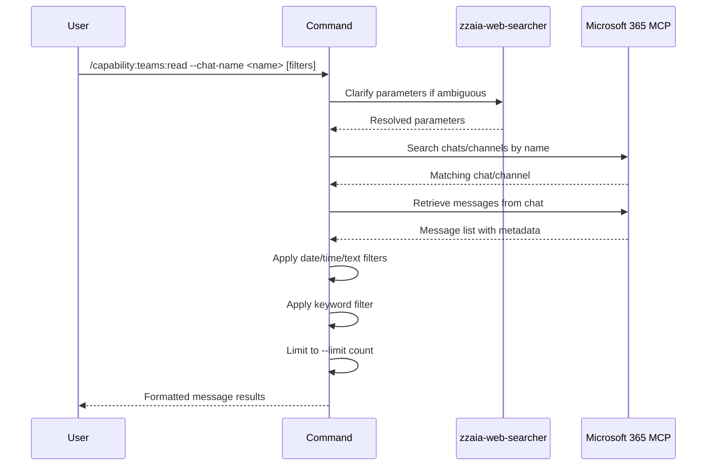

## PURPOSE

Read and retrieve Microsoft Teams chat or channel conversations with support for filtering by date range, message content, and keyword search. Uses Microsoft 365 MCP tools to access Teams data.

## EXECUTION

1. **Resolve Chat/Channel**: Search Teams chats and channels using `--chat-name`

   - Query Microsoft 365 MCP for available chats and channels
   - Match against provided name (partial match supported)
   - Confirm unique chat or return disambiguation if multiple matches
   - Handle ambiguous names by clarifying with user

2. **Retrieve Messages**: Fetch messages from matched conversation

   - Use Microsoft 365 MCP Teams tools to retrieve message history
   - Retrieve metadata: sender, timestamp, content
   - Preserve message order and threading information

3. **Apply Range Filters**: Parse and apply `--begin-message` and `--last-message` boundaries

   - If boundary is a date (YYYY-MM-DD): filter messages on/after that date
   - If boundary is time (HH:MM): filter by time within date
   - If boundary is text snippet: find message containing text and use as anchor
   - If datetime: use exact datetime comparison

4. **Apply Keyword Filter**: Filter messages by `--filter` if provided

   - Case-insensitive search within message content
   - Include only messages matching keyword

5. **Format Output**: Return structured results limited to `--limit`

   - Chat/channel name matched
   - Total message count retrieved and count after filters
   - Each message: `[YYYY-MM-DD HH:MM] Sender: message content`
   - Applied filters summary
   - Source confirmation (Teams MCP)

## DELEGATION

**MANDATORY**: Always invoke the agents defined in this command's frontmatter for their designated responsibilities. Never skip, replace, or simulate their behavior directly.

- `zzaia-web-searcher` — Analyze and disambiguate query parameters if chat name or boundaries are ambiguous

## WORKFLOW



## ACCEPTANCE CRITERIA

- Resolves chat/channel name using Microsoft 365 MCP (partial match support)
- Retrieves complete message history with sender and timestamp
- Parses date (YYYY-MM-DD), time (HH:MM), and text anchors for range filtering
- Case-insensitive keyword filtering on message content
- Respects `--limit` parameter (default 50)
- Returns messages in chronological order
- Handles missing chat with clear error message
- Handles ambiguous chat names by asking user for clarification
- Output shows applied filters and result count

## EXAMPLES

```
/capability:teams:read --chat-name "Product Launch" --limit 25
/capability:teams:read --chat-name "engineering" --filter "deployment" --limit 100
/capability:teams:read --chat-name "#general" --begin-message "2026-03-20" --last-message "2026-03-26"
/capability:teams:read --chat-name "planning" --begin-message "Started work on" --filter "deadline"
/capability:teams:read --chat-name "status-updates" --begin-message "10:00" --last-message "16:30" --limit 50
```

## OUTPUT

- Matched chat or channel name with confirmation
- Message count retrieved and count after applying filters
- Formatted message list: `[YYYY-MM-DD HH:MM] Sender: message content`
- Applied filters summary (date range, keywords, limit)
- Source confirmation (Microsoft 365 MCP)
- Any clarification requests if parameters are ambiguous
