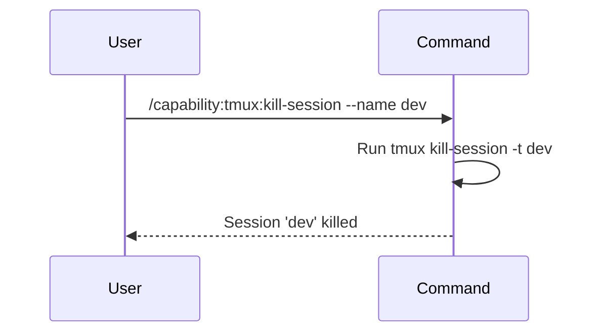

## PURPOSE

Terminate one or more tmux sessions. If a session name is provided, kills that specific session. If no name is provided, terminates all active sessions after requesting confirmation.

## EXECUTION

1. **Validate**: If session name provided, confirm it exists
2. **Confirm**: For kill-all operations, request explicit user confirmation
3. **Kill**: Execute appropriate kill command
   - Single session: `tmux kill-session -t <name>`
   - All sessions: `tmux kill-server`
4. **Verify**: Confirm the session(s) were killed successfully
5. **Report**: Display confirmation with killed session details

## WORKFLOW



## ACCEPTANCE CRITERIA

- Session name is validated if provided
- Kill-all operations require explicit confirmation
- kill-session command executes without error
- Targeted session is properly terminated
- All panes and windows in killed session are closed
- Confirmation shows session name(s) killed

## EXAMPLES

```
/capability:tmux:kill-session --name dev
/capability:tmux:kill-session --name build
/capability:tmux:kill-session --description "cleaning up test sessions"
/capability:tmux:kill-session
```

## OUTPUT

- Confirmation of session termination
- Session name(s) killed
- Number of windows and panes closed
- Warning if kill-all was performed
