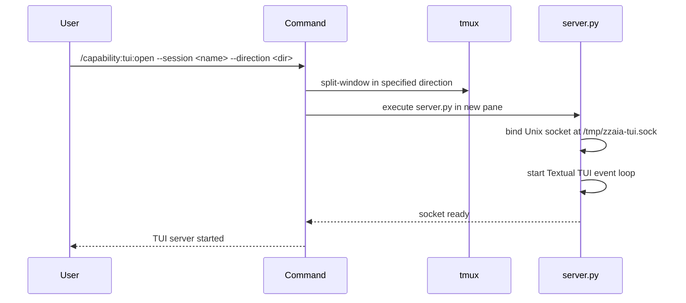

## PURPOSE

Start a Textual TUI server in a new tmux split pane. The TUI listens on a Unix socket at `/tmp/zzaia-tui.sock` for structured events and renders them as formatted log entries with color coding.

## EXECUTION

1. **Create tmux split**: Use `capability:tmux:split-window` to create a new pane in the specified direction
2. **Launch server**: Execute `server.py` in the new pane, which binds the Unix socket and starts the Textual app
3. **Verify socket**: Confirm the socket file exists at `/tmp/zzaia-tui.sock` and is ready for connections

## WORKFLOW



## ACCEPTANCE CRITERIA

- Socket file created at `/tmp/zzaia-tui.sock`
- PID file written to `/tmp/zzaia-tui.pid` on startup
- Textual TUI renders in new tmux pane
- TUI remains responsive to incoming events
- `server.py` continues running until shutdown signal received

## EXAMPLES

```
/capability:tui:open --session main --direction horizontal
/capability:tui:open --direction vertical
/capability:tui:open
```

## OUTPUT

- TUI window displayed in new tmux split pane
- Socket ready for write/read operations
- Process ID file available for shutdown reference
