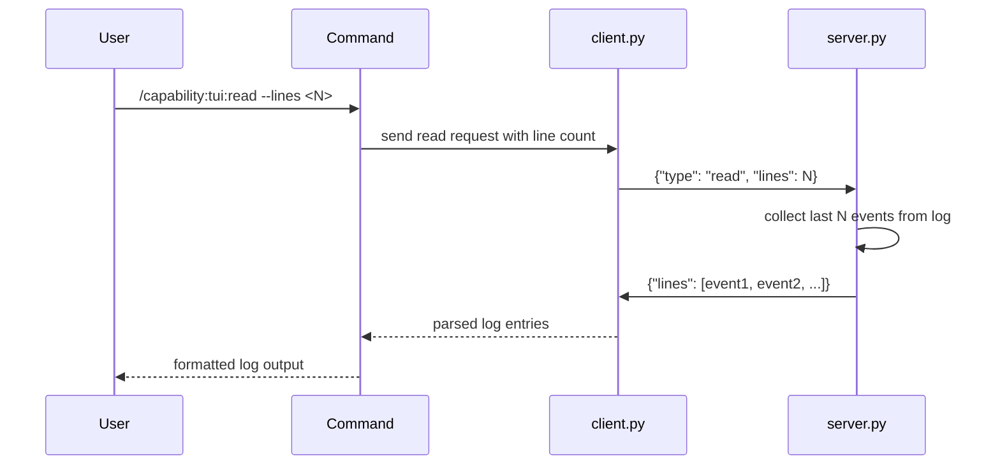

## PURPOSE

Query the TUI server for the last N log lines and retrieve them via the Unix socket. Useful for examining recent events or debugging the TUI state without interacting with the visual display.

## EXECUTION

1. **Parse input**: Extract `--lines` parameter (default to 50 if not provided)
2. **Build request**: Create `{"type": "read", "lines": N}`
3. **Send query**: Use `client.py` to send the request to `/tmp/zzaia-tui.sock`
4. **Parse response**: Extract and format the returned log lines

## WORKFLOW



## ACCEPTANCE CRITERIA

- Query sent successfully to socket
- Server responds with requested number of lines (or all available if fewer)
- Log entries returned in chronological order
- Output formatted for readability
- Connection closes after retrieval

## EXAMPLES

```
/capability:tui:read --lines 10
/capability:tui:read --lines 100
/capability:tui:read
```

## OUTPUT

- Last N log lines displayed in order
- Each entry shows type, timestamp (if available), and message
- Suitable for pasting into logs or documentation
