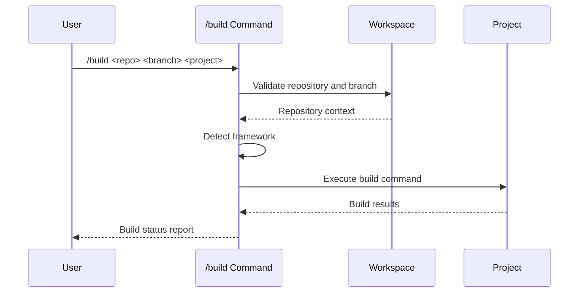

## PURPOSE

Build applications across multiple frameworks with comprehensive error reporting and no git operations.

## EXECUTION

1. **Validation**

   - Validate workspace repository and branch
   - Verify worktree existence
   - Check project structure

2. **Framework Detection**

   - Automatically detect project framework
   - Identify build configuration files
   - Determine appropriate build commands

3. **Build Execution**
   - NEVER try to fix code to enable building
   - Prefer building solutions
   - Execute framework-specific build
   - Capture build output and errors
   - Generate detailed error reports

## EXECUTION APPROACH

Direct build execution with comprehensive validation and error reporting.

## WORKFLOW



## EXAMPLES

```bash
# Build specific repository and branch
/build backend-hub master api

# Build feature branch
/build my-project feature/new-api
```

## OUTPUT

- Be concise
- Build success/failure status
- In case of error focus on listing errors and warnings messages
- Framework detection results
- Detailed error messages with file paths
- Build duration and component counts
- Warning and error classifications
