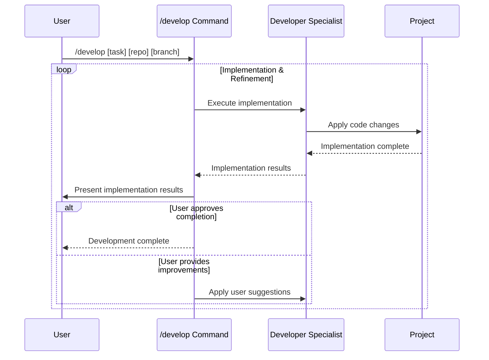

## PURPOSE

Execute focused implementation tasks for development work. Uses task specification from `/plan` command or assumes requirements are already clarified.

## EXECUTION

1. **Development Execution**

   - In case of not defined by the user, identify the related file or project by checking the user selected file or code lines in the IDE
   - In case of not being able to access selected file or code line, ask user which repository, branch and application to work
   - Executes implementation using zzaia-developer-specialist agent
     - Can execute multiple agents for parallel implementations

2. **Testing Development**

   - Implement tests after implementation only if user permission
   - Only implement tests if specificated by the user
   - Ask the user if tests should be implemented

3. **Finalizing**

   - Presents implementation results to user
   - Ask for user improvements
   - Execute them via developer specialist and continues loop
   - Process completes when implementation satisfies user requirements

## AGENTS

- **zzaia-developer-specialist**: Implementation and development tasks with user feedback integration

## WORKFLOW



## EXAMPLES

```bash
# Plan first (recommended)
/plan implement user authentication system
/develop Add user authentication with JWT tokens repo=auth-service branch=feature/jwt-auth

# Develop in specific repository and branch
/develop payment processing repo=compliance-hub branch=feature/payments

# Direct development (assumes requirements are clear)
/develop Create microservice architecture for order management repo=core-api branch=feature/microservices
```

## Acceptance Criteria

Defines when the whole process must be considered completed

- Implementation satisfies user requirements
- User approval granted for completion

## OUTPUT

- Implementation progress updates
- Code changes and file modifications
- Implementation completion status
- Final development completion confirmation
