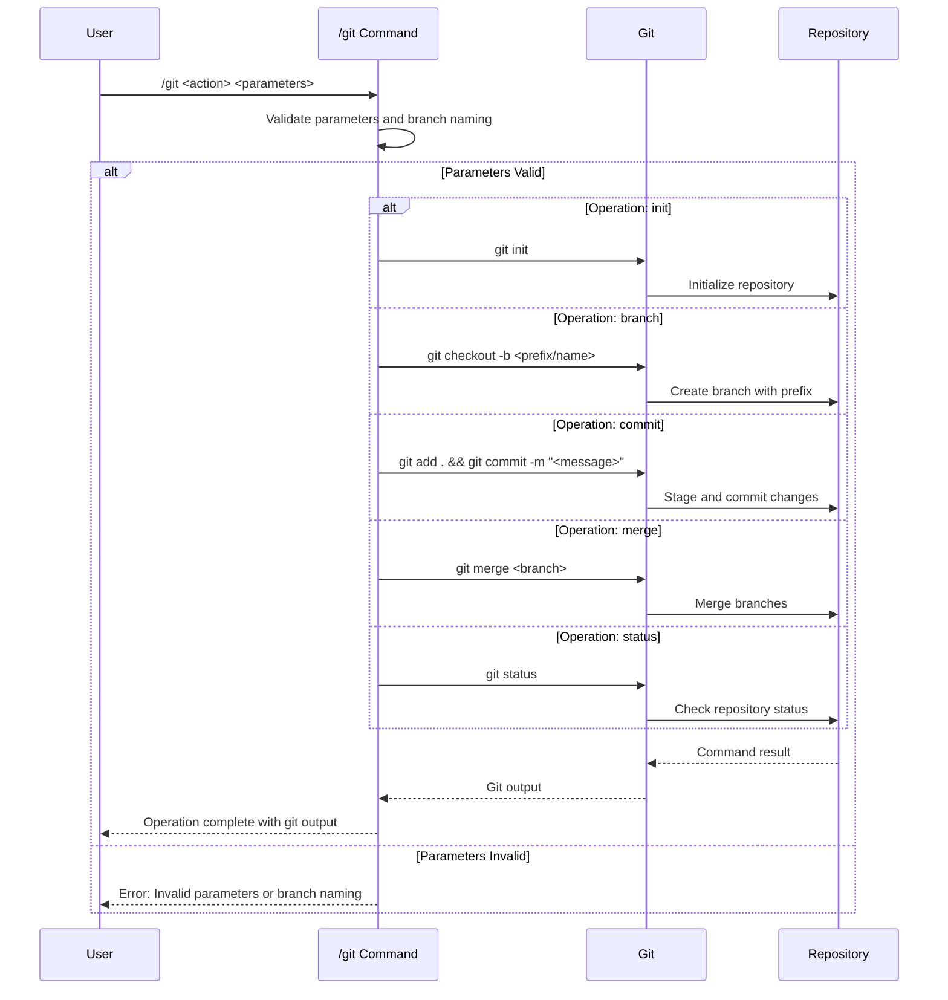

## PURPOSE

Execute Git version control operations directly with standardized branch management.

## STANDARDIZED BRANCH PREFIXES

Branch naming must follow these strict conventions:

- `feature/`: New feature development
  - Example: `feature/implement-user-authentication`
  - Used for developing new functionality

- `hotfix/`: Critical production fixes
  - Example: `hotfix/fix-security-vulnerability`
  - Reserved for urgent production issues requiring immediate resolution

- `improvement/`: Enhancements to existing functionality
  - Example: `improvement/optimize-search-performance`
  - Used for incremental improvements to existing systems

- `refactor/`: Code restructuring
  - Example: `refactor/restructure-authentication-service`
  - Used for code quality improvements without changing functionality

## EXECUTION

1. **Parameter Validation**
   - Validate action type and parameters
   - Check branch naming conventions
   - Verify repository context

2. **Direct Git Execution**
   - Execute git commands directly
   - Apply standardized branch prefixes
   - Use conventional commit formatting

3. **Operation Logging**
   - Log git command results
   - Report operation status
   - Display relevant output

## IMPLEMENTATION

- **Direct Git Operations**: No agent dependencies
  - Execute git commands directly in repository
  - Enforce branch naming and commit standards
  - Operate within current repository context

## WORKFLOW



## EXAMPLES

```bash
# Initialize a new repository
/git init my-project

# Create a feature branch
/git branch feature/user-login my-project

# Commit changes with conventional message
/git commit "feat: add authentication system" my-project

# Merge a feature branch
/git merge feature/user-login my-project

# Check repository status
/git status
```

## OUTPUT

- Direct git command output
- Branch creation/management results
- Commit confirmations
- Error and validation messages

## COMMIT ATTRIBUTION

All commits created by this command MUST include the following attribution footer:

```
🤖 Generated with zzaia workspace

Co-Authored-By: <current-model-name>
```

**Format Requirements**:
- Use "zzaia workspace" as the tool reference
- Include current model attribution without email (e.g., "Claude Sonnet 4.5", "Claude Opus 4.5")
- Dynamically use the model name that is currently active
- Add blank line before attribution block
- Place at end of commit message body

**Example Full Commit**:
```
feat: implement user authentication

- Add JWT token generation
- Implement password hashing
- Create login endpoint

🤖 Generated with zzaia workspace

Co-Authored-By: Claude Sonnet 4.5
```

**Note**: The model name in the example above should be replaced with the actual current model being used (e.g., Claude Opus 4.5, Claude Haiku 4, etc.)

## CONSTRAINTS

1. Branch names MUST follow standardized prefixes
2. Commit messages MUST use conventional commit format
3. Commit messages MUST include zzaia workspace attribution
4. Operations execute in current repository context
5. Direct git command execution with standardized formatting