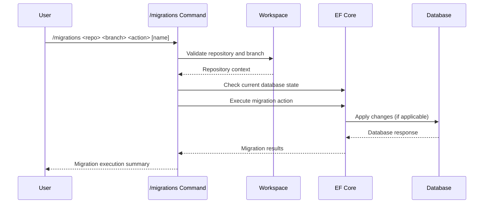

## PURPOSE

Manage Entity Framework Core database migrations with standardized actions and security best practices.

## EXECUTION

- **CRITICAL**: Always apply migrations in the .Data project or in the project where the DbContext is implemented
- NEVER apply migrations in the main application where appsettings are located
- This is a security measure to prevent direct database modifications in the primary application layer

1. **Validation Phase**

   - Verify repository and branch existence
   - Check EF Core project configuration
   - Validate migration action permissions

2. **Migration Preparation**

   - Switch to specified repository and branch
   - Restore project dependencies
   - Validate database connection

3. **Migration Execution**
   - Perform specified migration action
   - Generate migration scripts
   - Log migration details

## EXECUTION APPROACH

Direct EF Core migration management with comprehensive validation and security measures.

## WORKFLOW



## PARAMETERS

- `repository`: Git repository name containing the EF Core project
- `branch`: Specific branch for migration execution
- `action`: Migration operation type
  - `add`: Create new migration capturing model changes
  - `remove`: Remove last migration
  - `list`: List all migrations
  - `update`: Apply pending migrations to database
  - `script`: Generate SQL migration script
  - `drop`: Drop database (caution)
- `migration-name`: Optional descriptive name for migration (recommended for `add` action)

## EXAMPLES

```bash
# Add a new migration
/migrations compliance-hub main add AddUserProfile

# Update database to latest migration
/migrations customer-portal develop update

# List all migrations
/migrations identity-service feature/auth list

# Generate SQL script
/migrations my-project main script
```

## OUTPUT

- Detailed migration script preview
- Database schema change log
- Migration execution status
- Security validation results
- Database state snapshot
