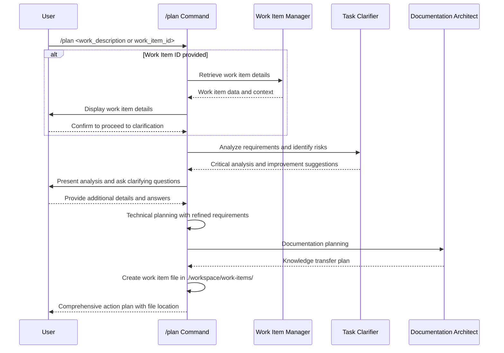

## PURPOSE

Generate or update comprehensive, actionable plans for user-requested work by analyzing requirements from user descriptions or work items, with detailed phase breakdown, risk assessment, and implementation strategy. Serves as a pre-development planning step before using `/develop` command.

## EXECUTION

1. **Work Item Retrieval & Display** (if work item ID provided)

   - Use zzaia-work-item-manager to fetch work item details
   - **Display all work item information to user** (title, description, pro acceptance criteria, status)
   - **Ask user to confirm proceeding to clarification phase**
   - Extract requirements, acceptance criteria, and context for analysis

2. **Initial Requirements Analysis**

   - Use zzaia-task-clarifier for rigorous problem analysis
   - Identify involved projects, applications and architectural concerns
   - Generate critical questions and risk assessments
   - Receive suggestions for plan improvements

3. **User Interaction & Clarification**

   - **Wait for user confirmation before proceeding** (from phase 1)
   - Present task clarifier analysis and recommendations
   - Ask clarifying questions based on agent feedback
   - Gather additional requirements and constraints
   - Refine scope and success criteria with user input

4. **Technical Planning & Documentation**

   - Review existing implementations and architecture
   - Generate architecture plan through direct analysis
     - Identify application layers that must be implemented
     - Identify all patterns, tools, packages and SDKs that will be used
     - Identify the communication interface between applications
   - Generate step-by-step implementation plan
     - Identify steps that can be executed in parallel
     - Identify steps that must be executed sequentially
     - Let's keep all steps related to one application ALWAYS as sequential
     - Let's keep multi applications steps ALWAYS as parallel
   - No need to write code in documentations

5. **Plan Finalization**

   - Create one concise risk analysis documentation using the @agent-zzaia-documentation-architect
   - Create one concise plan documentation using the @agent-zzaia-documentation-architect
     - The plan documentation must have a step-by-step implementation diagram, and step checkboxes with descriptions
   - Create a concise architecture documentation using the @agent-zzaia-documentation-architect
     - Each application involved in the plan must have it's own architecture documentation
     - The architecture documentation must have the mermaid sequential diagram about the application logical flow that will be implemented
   - Create all documentations in `./workspace/work-items/<WorkItemName>` folder
   - Display the overall information in prompt
   - Estimate agentic developing time, complexity, and resource requirements

6. **User Interaction & Improvements**

   - Ask if user has any more improvements or rectifications to plan or during implementation
   - Refine the plan and implementation definitions and documents with user input

## AGENTS

- **zzaia-work-item-manager**: Work item retrieval and data preparation
- **zzaia-task-clarifier**: Critical analysis, problem understanding, and improvement recommendations (analysis-only, no file creation)
- **zzaia-documentation-architect**: Documentation and knowledge transfer planning

## WORKFLOW



## EXAMPLES

```bash
# Plan from user description
/plan implement user authentication system

# Plan from Azure DevOps work item
/plan ADO-12345

# Plan from GitHub issue
/plan GH-67890

# Plan infrastructure work
/plan migrate database to new server

# Plan documentation project
/plan create API documentation for microservices
```

## OUTPUT

- Interactive clarification session with user
- Critical analysis and risk assessment from task clarifier
- Comprehensive action plan with phase breakdown
- Implementation strategy and alternatives
- Resource requirements and time estimates
- Documentation and knowledge transfer plan
