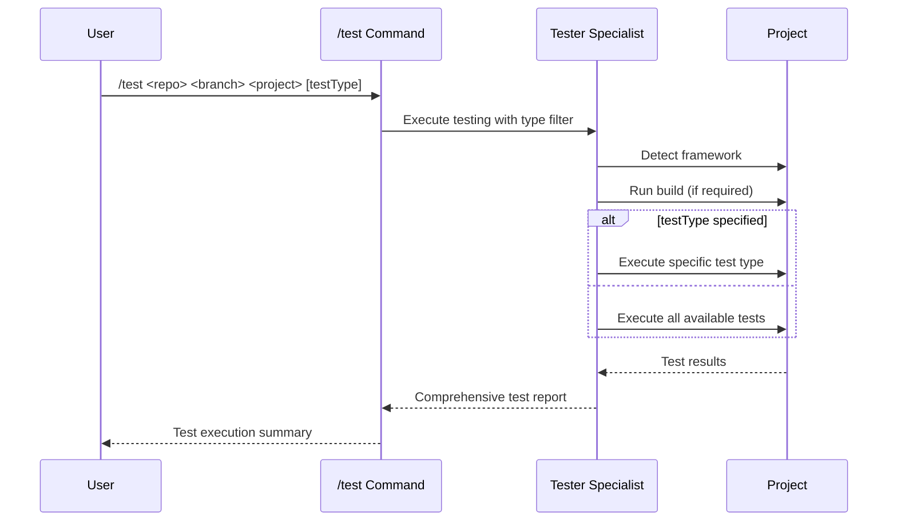

## PURPOSE

Execute all existing tests within a specific project using framework detection to run building, unit, integration, and a-b or load testing comprehensively.

## EXECUTION

1. **Project Validation**

   - Verify repository and branch exist in workspace
   - Validate project structure within branch
   - Check for test configurations

2. **Framework Detection**

   - Automatically detect testing framework
   - Identify test types: unit, integration, a-b testing
   - Determine build requirements

3. **Test Execution**
   - NEVER try to fix tests or applications
   - NEVER try to implement new tests
   - Execute build process if required
   - Run specified test types or all available tests
   - Apply test type filtering (unit, integration, load, ab)
   - Execute tests with coverage analysis
   - Generate comprehensive test reports
   - In case of not finding tests just skip testing

## AGENTS

- **zzaia-tester-specialist**: Framework detection and comprehensive test execution in readonly mode

## WORKFLOW



## EXAMPLES

```bash
# Test all types in specific project
/test backend-hub master api

# Test only unit tests
/test backend-hub master api unit

# Test only integration tests
/test compliance-hub feature/new-module core integration

# Test load tests
/test frontend-app main dashboard load

# Test a-b tests
/test frontend-app main dashboard ab
```

## OUTPUT

- Be concise
- Build success/failure status
- Test success/failure status
- In case of error focus on listing errors and warnings messages
- List all running tests
- Framework detection results
- A-B test results (if available)
- Performance metrics and execution time
