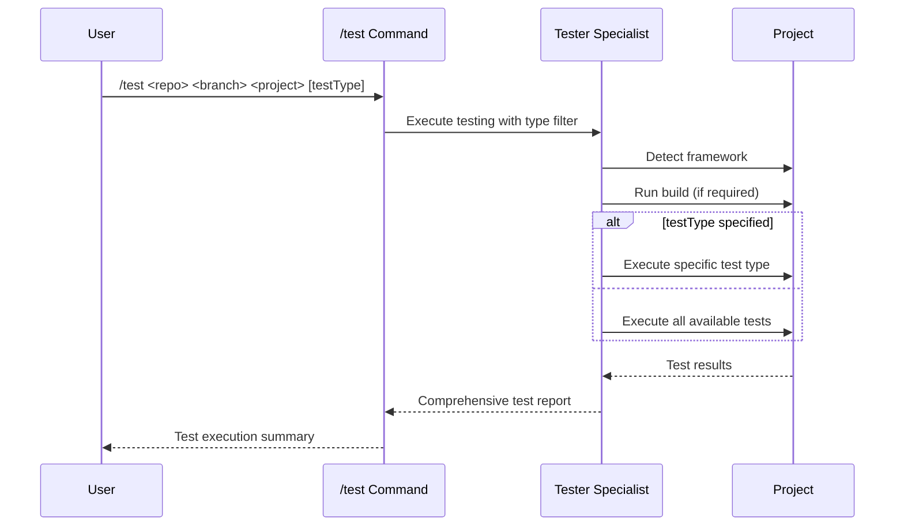

## PURPOSE

Develop and run all existing tests within a specific project using framework detection to run building, unit, integration, and a-b or load testing comprehensively.

## EXECUTION

1. **Project Validation**

   - Verify repository and branch exist in workspace
   - Validate project structure within branch
   - Check for test configurations

2. **Framework Detection**

   - Automatically detect testing framework
   - Identify test types: unit, integration, a-b testing
   - Determine build requirements

3. **Develop Test cases**

   - Skip this step in case of just running tests
   - Executes implementation using zzaia-developer-specialist agent
     - Can execute multiple agents for parallel implementations

4. **Test Execution**
   - Execute build process if required
   - Run specified test types or all available tests
   - Apply test type filtering (unit, integration, load, ab)
   - Execute tests with coverage analysis
   - Generate comprehensive test reports
   - In case of not finding tests just skip testing

## AGENTS

- **zzaia-tester-specialist**: Framework detection and comprehensive test execution in readonly mode
- **zzaia-developer-specialist**: Developer agent when a test need to be implemented or changed

## WORKFLOW



## EXAMPLES

```bash
# Test all types in specific project
/test backend-hub master api

# Test only unit tests
/test backend-hub master api unit

# Test only integration tests
/test compliance-hub feature/new-module core integration

# Test load tests
/test frontend-app main dashboard load

# Test a-b tests
/test frontend-app main dashboard ab
```

### Testing Types

1. Load Testing (Primary Use Case)
   Simulating normal expected load
   Testing system performance under typical user traffic
2. Stress Testing
   Testing beyond normal capacity
   Finding breaking points and system limits
3. Spike Testing
   Testing sudden traffic increases
   Validating system behavior during traffic spikes
4. Volume Testing
   Testing with large amounts of data
   Database performance under heavy data loads
5. Smoke Testing
   Basic functionality verification
   Quick sanity checks with minimal load
6. API Testing
   Functional API testing (not just performance)
   Response validation
   Data integrity checks
7. End-to-End Testing
   Browser automation testing
   User journey testing

### Testing Frameworks

1. Grafana K6, using JavaScript code to define testing cases
2. Locust, using python code to define testing cases

## OUTPUT

- Be concise
- Build success/failure status
- Test success/failure status
- In case of error focus on listing errors and warnings messages
- List all running tests
- Framework detection results
- A-B test results (if available)
- Performance metrics and execution time
