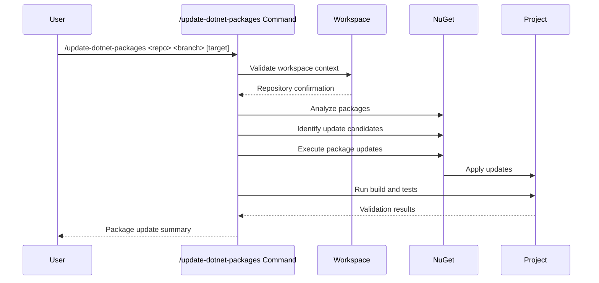

## PURPOSE

Update NuGet packages across .NET projects with comprehensive validation, safety checks, and rollback capabilities.

## EXECUTION

1. **Workspace Validation**
   - Verify repository and branch existence
   - Validate .NET project structure
   - Check package configuration files

2. **Package Analysis**
   - Identify update candidates
   - Analyze dependency conflicts
   - Assess security vulnerabilities

3. **Update Execution & Validation**
   - Apply package updates safely
   - Execute build and test validation
   - Prepare rollback information

## EXECUTION APPROACH

Direct NuGet package management with comprehensive validation and safety checks.

## WORKFLOW



## PARAMETERS

- `repoName`: Repository name in workspace
- `branch`: Branch name for package updates
- `target`: Update target (optional)
  - `all`: Update all packages (default)
  - `project <name>`: Update specific project
  - `outdated`: Update only outdated packages
  - `major`: Allow major version updates

## EXAMPLES

```bash
# Update all packages
/update-dotnet-packages compliance-hub master

# Update specific project
/update-dotnet-packages my-project develop project MyProject

# Update only outdated packages
/update-dotnet-packages api-service main outdated
```

## OUTPUT

- Package update summary with version changes
- Security vulnerability assessment
- Build and test validation results
- Dependency conflict analysis
- Rollback preparation status