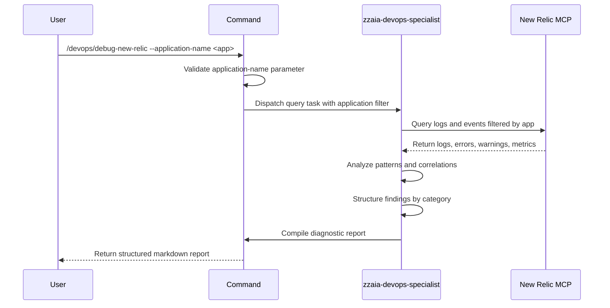

## PURPOSE

Query New Relic MCP for logs, issues, warnings, and anomalies from a specified application, then generate a structured diagnostic report with error patterns, timeline summary, and actionable insights.

## EXECUTION

1. **Connect and Query**: Establish connection to New Relic MCP and retrieve logs filtered by application-name from the last 24 hours

   - Query error logs and stack traces
   - Retrieve warning events and anomalies
   - Extract transaction performance metrics

2. **Analyze Findings**: Process results to identify patterns and correlations

   - Group errors by error type and frequency
   - Identify warning trends and timestamps
   - Map error occurrences to timeline

3. **Generate Report**: Compile structured diagnostic output in conversation prompt

   - Issues section with error details and count
   - Warnings section with severity levels
   - Error patterns with common causes
   - Timeline summary of key events

## DELEGATION

**MANDATORY**: Always invoke the agent defined in this command's frontmatter for its designated responsibilities. Never skip, replace, or simulate its behavior directly.

- `zzaia-devops-specialist` — Query New Relic MCP tools, analyze diagnostic data, and compile structured report

## WORKFLOW



## ACCEPTANCE CRITERIA

- Successfully connects to New Relic MCP with provided application name
- Retrieves and processes logs from the last 24 hours
- Report includes distinct sections for Issues, Warnings, Error Patterns, and Timeline
- Error patterns are deduplicated and grouped by root cause
- Timestamps are included for all critical events

## EXAMPLES

```
/devops/debug-new-relic --application-name payment-service
/devops/debug-new-relic --application-name api-gateway
```

## OUTPUT

- Structured markdown report with sections:
  - **Issues**: Error count, types, and stack traces
  - **Warnings**: Warning events with timestamps and severity
  - **Error Patterns**: Grouped by cause with frequency
  - **Timeline**: Chronological summary of key events
