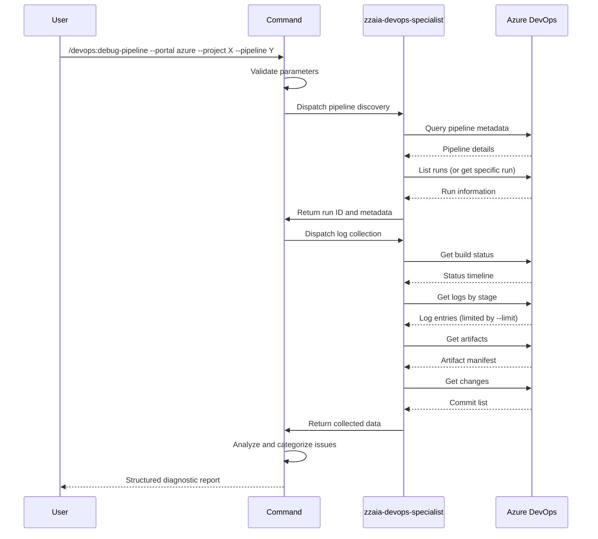

## PURPOSE

Query Azure DevOps pipeline infrastructure to collect comprehensive logs, build status, and artifacts. Generate structured diagnostic report identifying failed stages, errors, warnings, and anomalies without modifying pipeline state.

## EXECUTION

1. **Discover Pipeline**: Resolve pipeline by ID or name, retrieve specified run or latest run

   - Query pipeline metadata
   - Resolve run ID if not provided
   - Validate pipeline exists and is accessible

2. **Collect Logs & Status**: Fetch build status, logs per stage, failed steps, and artifacts

   - Get build status and execution timeline
   - Extract logs by stage
   - Identify failed steps with timestamps
   - List artifacts and detect anomalies

3. **Analyze & Report**: Categorize issues by severity, generate structured diagnostic output

   - Group issues by stage (Failed, Warnings, Artifacts)
   - Include log excerpts from failed steps
   - Map commits that triggered the run
   - Format summary table with pipeline execution details

## DELEGATION

The `zzaia-devops-specialist` agent executes all Azure DevOps MCP queries:

- `mcp__azure-devops__pipelines_list_runs` — retrieve available runs for pipeline
- `mcp__azure-devops__pipelines_get_run` — fetch specific run details
- `mcp__azure-devops__pipelines_get_build_status` — retrieve build status
- `mcp__azure-devops__pipelines_get_build_log` — fetch stage logs
- `mcp__azure-devops__pipelines_get_build_log_by_id` — retrieve specific log entry
- `mcp__azure-devops__pipelines_list_artifacts` — enumerate build artifacts
- `mcp__azure-devops__pipelines_get_build_changes` — identify commits in run

## WORKFLOW



## ACCEPTANCE CRITERIA

- Resolves pipeline by ID or name without ambiguity
- Defaults to latest run when --run not specified
- Report includes summary table with: pipeline name, run ID, status, duration, triggered by
- Issues grouped by stage with severity indicators (❌ Failed, ⚠️ Warning)
- Failed step details with log excerpts (first --limit entries per stage)
- Linked commits in run displayed with messages
- Read-only operation (no pipeline modifications, no triggers)
- Handles missing runs or pipelines gracefully with clear error messages
- Output formatted for terminal readability

## EXAMPLES

```
/devops:debug-pipeline --portal azure --project MyProject --pipeline build-pipeline

/devops:debug-pipeline --portal azure --project MyProject --pipeline 42 --run 1850

/devops:debug-pipeline --portal azure --project MyProject --pipeline deploy-prod --limit 20
```

## OUTPUT

- **Summary Table**: Pipeline metadata, run ID, status, duration, triggered by user/trigger
- **Stage Analysis**: Each stage with pass/fail status and step count
- **Failed Steps**: Stage name, step name, error log excerpt, timestamp
- **Warnings**: Non-fatal issues, deprecation notices, timeout warnings
- **Artifacts**: Artifact names, sizes, artifact metadata anomalies
- **Changes**: Commits that triggered run with message and author
- **Diagnostics**: Query execution time, data points collected, any missing data warnings
