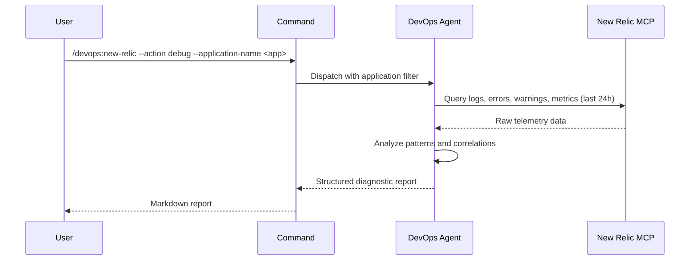

## PURPOSE

Single interface for New Relic observability. Routes to diagnostics based on `--action`.

## ACTIONS

| Action  | Description                                                              |
|---------|--------------------------------------------------------------------------|
| `debug` | Query logs, errors, warnings, and anomalies; generate diagnostic report  |

## EXECUTION

### action=debug

1. **Query New Relic** — Retrieve logs filtered by `--application-name` from the last 24 hours: error logs, stack traces, warning events, anomalies, transaction performance metrics
2. **Analyze** — Group errors by type and frequency; identify warning trends; map occurrences to timeline
3. **Report** — Generate structured markdown with Issues, Warnings, Error Patterns, and Timeline sections

## DELEGATION

**MANDATORY**: Always invoke the agents defined in this command's frontmatter for their designated responsibilities. Never skip, replace, or simulate their behavior directly.

- `zzaia-devops-specialist` — Query New Relic MCP tools, analyze diagnostic data, and compile structured report

## WORKFLOW



## ACCEPTANCE CRITERIA

- Connects to New Relic MCP with provided application name
- Retrieves and processes logs from the last 24 hours
- Report includes distinct sections: Issues, Warnings, Error Patterns, Timeline
- Errors deduplicated and grouped by root cause
- Timestamps included for all critical events

## EXAMPLES

```
/devops:new-relic --action debug --application-name payment-service
/devops:new-relic --action debug --application-name api-gateway
```

## OUTPUT

- **Issues**: Error count, types, and stack traces
- **Warnings**: Warning events with timestamps and severity
- **Error Patterns**: Grouped by cause with frequency
- **Timeline**: Chronological summary of key events
