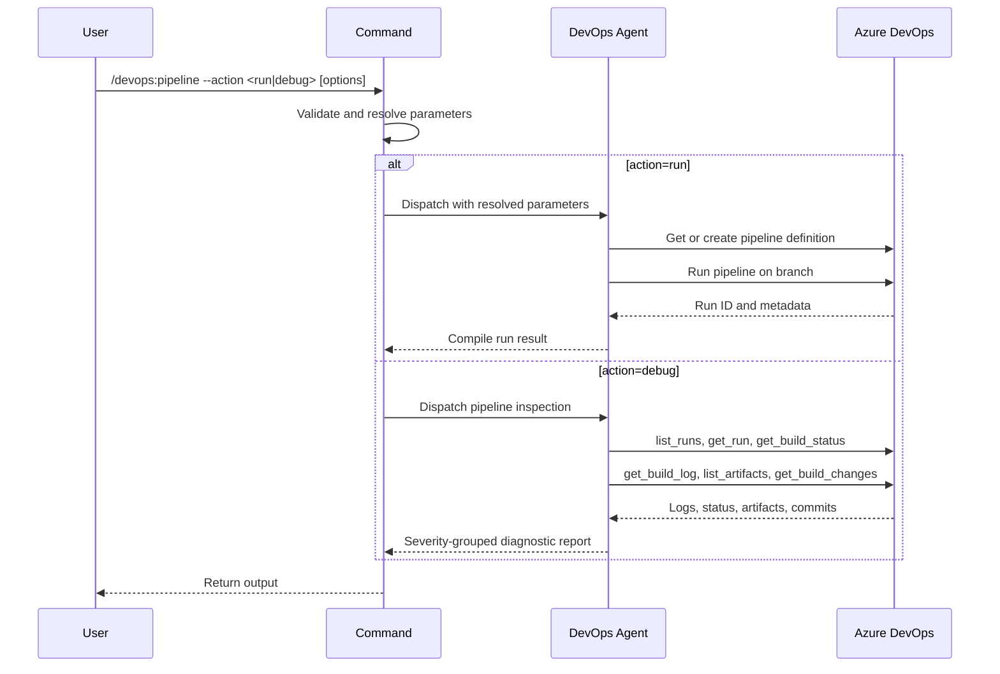

## PURPOSE

Single interface for Azure DevOps pipeline management. Routes to execution or diagnostics based on `--action`.

## ACTIONS

| Action  | Description                                                     |
|---------|-----------------------------------------------------------------|
| `run`   | Trigger an existing or new pipeline; return run ID and URL      |
| `debug` | Collect build logs and metrics; generate structured issue report |

## EXECUTION

### action=run

1. **Resolve Context** — If `--file` provided, read git worktree metadata to infer `--project`, `--branch`, `--file-name`
2. **Select Pipeline** — Use `--pipeline` to get existing definition, or `--file-name` to create a new one
3. **Trigger Run** — Execute pipeline on target branch; capture run ID and metadata
4. **Report** — Return run ID, URL, branch, commit SHA; suggest `--action debug` for log inspection

### action=debug

1. **Discover Pipeline** — Resolve pipeline by ID or name; resolve run ID (defaults to latest)
2. **Collect Logs & Status** — Fetch build status, logs per stage, failed steps, artifacts, and linked commits
3. **Report** — Group issues by stage ❌ ⚠️; include log excerpts, artifact manifest, and commit list

## DELEGATION

**MANDATORY**: Always invoke the agents defined in this command's frontmatter for their designated responsibilities. Never skip, replace, or simulate their behavior directly.

- `zzaia-devops-specialist` — Execute all Azure DevOps MCP pipeline operations

## WORKFLOW



## ACCEPTANCE CRITERIA

- `run`: resolves missing parameters from `--file`; returns run ID, URL, branch, and commit SHA
- `debug`: read-only; report includes summary table, failed steps with log excerpts, artifacts, and linked commits

## EXAMPLES

```
/devops:pipeline --action run --portal azure --project MyProject --pipeline build-pipeline --branch main
/devops:pipeline --action run --portal azure --file workspace/myrepo.worktrees/feature/my-feature/azure-pipelines.yml
/devops:pipeline --action debug --portal azure --project MyProject --pipeline build-pipeline
/devops:pipeline --action debug --portal azure --project MyProject --pipeline 42 --run 1850 --limit 20
```

## OUTPUT

- `run`: run ID, URL, target branch, commit SHA, follow-up suggestion
- `debug`: summary table (pipeline, run ID, status, duration), stage analysis, failed steps, warnings, artifacts, commits
