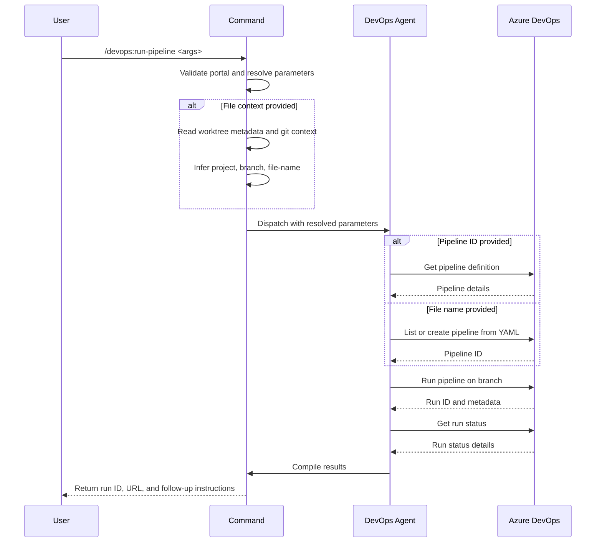

## PURPOSE

Execute Azure DevOps pipelines with flexible parameter resolution. Supports running existing pipelines by ID/name or creating and running new pipelines from YAML definitions. Automatically infers project, branch, and pipeline file details from local workspace context when --file is provided.

## EXECUTION

1. **Context Resolution**: Validate arguments and infer missing parameters from workspace metadata
   - If --file provided, read git worktree context (repository-metadata.json, git remote, current branch)
   - Populate missing --project, --branch, and --file-name values
   - Validate required parameters (--portal, --project, --branch)

2. **Pipeline Selection**: Determine pipeline action based on provided arguments
   - If --pipeline provided, retrieve existing pipeline definition
   - If only --file-name provided, list available pipelines or prepare to create new definition
   - Validate pipeline or YAML file exists in project

3. **Pipeline Execution**: Trigger pipeline run with resolved parameters
   - Create new pipeline definition if --file-name provided without --pipeline
   - Run selected or newly created pipeline on target branch
   - Capture run ID and metadata for status tracking

4. **Status Reporting**: Return execution results and follow-up instructions
   - Confirm pipeline triggered with run ID
   - Provide run URL for monitoring
   - Report target branch and commit SHA
   - Suggest /devops:debug-pipeline for log inspection

## DELEGATION

**MANDATORY**: Invoke `zzaia-devops-specialist` for all Azure DevOps MCP operations. Never skip or simulate agent behavior directly.

- `zzaia-devops-specialist` — Execute Azure DevOps pipeline queries, create pipeline definitions, and trigger pipeline runs using designated MCP tools

## WORKFLOW



## ACCEPTANCE CRITERIA

- Resolves all missing parameters from --file context when provided
- Runs existing pipeline by ID or name without errors
- Creates and runs new pipeline from YAML file when --file-name provided
- Returns run ID, run URL, and target branch/commit information
- Provides actionable follow-up command for log inspection

## EXAMPLES

```
/devops:run-pipeline --portal azure --project MyProject --pipeline build-pipeline --branch main

/devops:run-pipeline --portal azure --file /home/user/workspace/myrepo.worktrees/feature/my-feature/azure-pipelines.yml

/devops:run-pipeline --portal azure --project MyProject --file-name azure-pipelines.yml --branch feature/new-feature
```

## OUTPUT

- Pipeline run confirmation with run ID
- Run URL for real-time monitoring
- Target branch and commit SHA executed
- Recommendation to use `/devops:debug-pipeline --run-id <id>` for detailed logs
