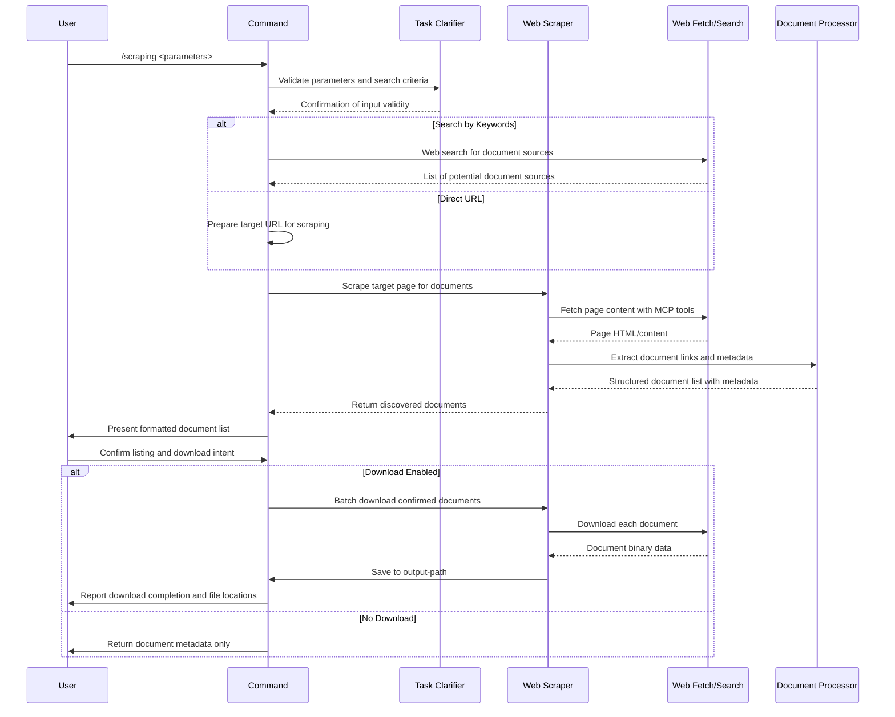

## PURPOSE

Enable efficient document discovery and extraction from web sources by searching for PDF and Word documents (doc, docx) through direct URLs or keyword-based web searches. The command provides user confirmation checkpoints before listing documents and downloading, supports filtering on target pages, and integrates with web scraping tools and web search capabilities.

## EXECUTION

1. **Input Validation & Search Discovery**: Validate parameters and determine search strategy
   - Validate that either url or search parameter is provided (mutually exclusive)
   - If search provided, use the web search command to locate document sources
   - If url provided, prepare direct scraping of target page
   - Parse and validate filters parameter if provided

2. **Document Discovery & Extraction**: Locate and catalog documents on target source
   - Scrape target page/URL for document links (PDF, doc, docx only)
   - Extract metadata for each document (title, size, type, URL)
   - Apply user-specified filters to refine results
   - Compile comprehensive list of discovered documents

3. **User Confirmation & Download Coordination**: Confirm actions before execution
   - Present formatted list of all discovered documents
   - Request user confirmation to proceed with download
   - If download enabled, confirm output path and disk space
   - Coordinate batch downloading of confirmed documents
   - Report progress and handle partial failures

## AGENTS

- **zzaia-task-clarifier**: Clarify document search criteria and filter requirements
- **web-scraper-agent**: Execute document extraction from target URLs using MCP tools
- **document-processor-agent**: Extract metadata and process document listings

## WORKFLOW



## ACCEPTANCE CRITERIA

- Command accepts either url or search parameter (mutually exclusive, at least one required)
- Discovers and lists only PDF and Word documents (doc, docx extensions)
- Extracts document metadata including title, size, type, and source URL
- Applies user-specified filters to refine document search results
- Presents complete document list requiring explicit user confirmation before download
- Downloads documents to specified output path with progress reporting
- Handles network errors and partial failures gracefully
- Integrates with web search capabilities for keyword-based document discovery
- Provides meaningful error messages for invalid parameters or failed operations
- All user confirmations are explicit and documented in output

## EXAMPLES

```
/scraping url=https://example.com/documents filters='{"format": "pdf", "date": "2024"}'

/scraping search="machine learning research papers" download=true output-path=/workspace/downloads/ml-papers

/scraping url=https://company.com/resources filters='{"category": "technical", "language": "english"}' download=false

/scraping search="legal compliance documents 2025" download=true
```

## OUTPUT

- Formatted table of discovered documents with metadata (title, type, size, URL)
- Confirmation prompts for listing and download actions
- Download progress reporting with file paths and status
- Summary statistics (total documents found, downloaded count, file sizes)
- Error logs for failed document retrievals
