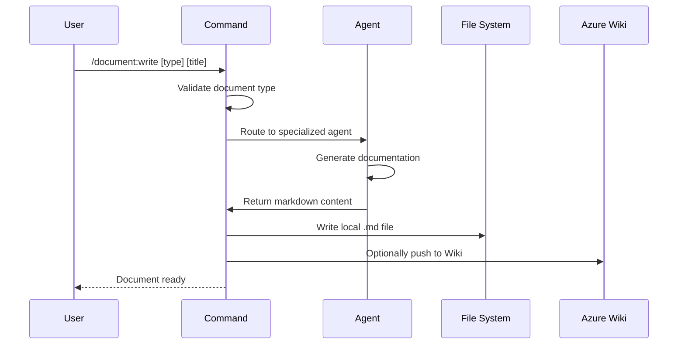

## PURPOSE

Write markdown documentation with specialized agent templates ensuring consistency in formatting, structure, and compliance with ZZAIA conventions. Route to appropriate agent based on document type and support writing to both local files and remote Wiki page.

## EXECUTION

1. **Clarify Document Type**: Identify or ask which documentation type to write
   - template-architecture-overview: Architecture overview with ADRs and C4 diagrams
   - template-service-architecture: Individual service architecture
   - template-service-data-model: Service data models and entities
   - template-event-notification: Event notifications and pub/sub catalog

2. **Route to Specialized Agent**: Dispatch to appropriate agent based on document type
   - Agent handles template structure, formatting, and conventions
   - Agent generates comprehensive documentation content
   - Ensure output follows ZZAIA conciseness standards

3. **Write Output**: Generate markdown file at specified location
   - Write local .md file if output path provided
   - Push to remote Wiki pages if --wiki flag set
   - Maintain consistent formatting across all outputs

## DELEGATION

**MANDATORY**: Always invoke the agents defined in this command's frontmatter for their designated responsibilities. Never skip, replace, or simulate their behavior directly.

- `template-architecture-overview` — Architecture overview with ADRs and C4 diagrams
- `template-service-architecture` — Individual service architecture documentation
- `template-service-data-model` — Entity, value objects, and data modeling documentation
- `template-event-notification` — Event catalog, topics, and pub/sub configuration

## WORKFLOW



## ACCEPTANCE CRITERIA

- Document type correctly identified or prompted from user
- Specialized agent template applied to output
- Local markdown file written to specified path
- Remote Wiki page integration available via --wiki flag
- Documentation follows ZZAIA conventions
- Consistent formatting across all document types

## EXAMPLES

```
/document:write template-architecture-overview "System Architecture"
/document:write template-service-architecture "User Service" --output docs/user-service.md
/document:write template-service-data-model "Order Entity" --output docs/order-models.md --wiki
/document:write template-event-notification "Payment Events" --repo payments --wiki
```

## OUTPUT

- Local markdown file at specified path
- Optional remote Wiki page with formatted content
