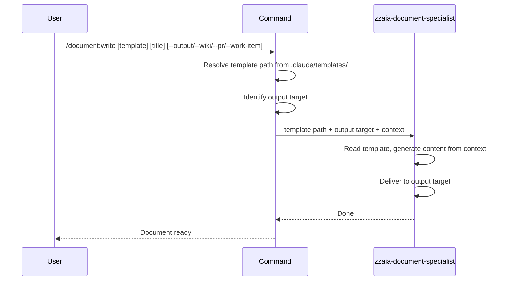

## PURPOSE

Select a documentation template from `.claude/templates/`, generate content from conversation context following the template structure, and deliver to the requested output target.

## EXECUTION

1. **Select Template**: Identify or ask which template to use
   - `architecture-overview` → `.claude/templates/architecture-overview.md`
   - `service-architecture` → `.claude/templates/service-architecture.md`
   - `service-data-model` → `.claude/templates/service-data-model.md`
   - `event-notification` → `.claude/templates/event-notification.md`

2. **Select Output Target**: Identify from flags or ask
   - `--output <path>` — write local markdown file
   - `--wiki` — push to Azure DevOps Wiki page
   - `--pr <id>` — post as pull request description or comment
   - `--work-item <id>` — post as work item description or comment

3. **Invoke Agent**: Call `zzaia-document-specialist` with template path and output target

## DELEGATION

**MANDATORY**: Always invoke the agents defined in this command's frontmatter. Never skip or simulate their behavior.

- `zzaia-document-specialist` — reads template, generates content from conversation context, delivers to output

## WORKFLOW



## EXAMPLES

```
/document:write architecture-overview "System Architecture" --output docs/architecture.md
/document:write service-architecture "Payment Service" --wiki
/document:write service-data-model "Order Entity" --output docs/data-model.md --wiki
/document:write event-notification "Payment Events" --pr 42
/document:write service-architecture "User Service" --work-item 1234
```

## OUTPUT

- Local markdown file, Wiki page, PR description/comment, or work item description/comment
