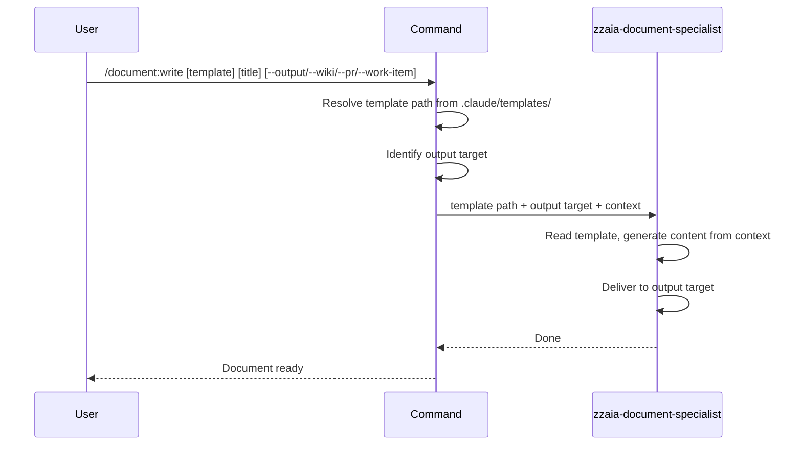

## PURPOSE

Select a documentation template from `.claude/templates/`, generate content from conversation context following the template structure, and deliver to the requested output target.

## EXECUTION

1. **Select Template**: Identify or ask which template to use

   | Template | Use when |
   |----------|----------|
   | `architecture-overview` | Documenting the high-level design of a system or platform spanning multiple services |
   | `service-architecture` | Documenting a single service SDD — bounded context, API contracts, ADRs, data model |
   | `service-data-model` | Documenting entities, aggregates, value objects, and relationships for a domain model |
   | `event-notification` | Documenting domain events, message contracts, and event-driven integration patterns |
   | `integration-tests-plan` | Documenting test scenarios for API/service integration testing with Given/When/Then |
   | `implementation-plan` | Documenting a step-by-step implementation plan for a feature or task |
   | `e2e-test-failure-report` | Documenting E2E test results with failures, New Relic diagnostics, and bug summary |

2. **Select Output Target**: Identify from flags or ask

   | Flag | Target | Markdown Support |
   |------|--------|-----------------|
   | `--output <path>` | Local markdown file | Full |
   | `--wiki` | Azure DevOps Wiki page | Full |
   | `--pr <id>` | Pull request description or comment | Full |
   | `--work-item <id>` | Work item description or comment | Partial — no mermaid |

3. **Adapt Format to Target**: Keep the same template structure and sections for all targets. When the target has partial markdown support:
   - Preserve all headings, tables, bullet points, and code blocks
   - Skip mermaid diagrams — replace with a plain-text summary of the diagram intent if relevant
   - Do not alter section order or omit content

4. **Invoke Agent**: Call `zzaia-document-specialist` with template path, output target, and format constraints

## DELEGATION

**MANDATORY**: Always invoke the agents defined in this command's frontmatter. Never skip or simulate their behavior.

- `zzaia-document-specialist` — reads template, generates content from conversation context, delivers to output

## WORKFLOW



## EXAMPLES

```
/document:write architecture-overview "System Architecture" --output docs/architecture.md
/document:write service-architecture "Payment Service" --wiki
/document:write service-data-model "Order Entity" --output docs/data-model.md
/document:write event-notification "Payment Events" --pr 42
/document:write integration-tests-plan "Checkout Flow Tests" --output docs/tests/checkout.md
/document:write implementation-plan "Add Order Status Endpoint" --work-item 1234
/document:write e2e-test-failure-report "Sprint 12 E2E Results" --work-item 2001
```

## OUTPUT

- Local markdown file, Wiki page, PR description/comment, or work item description/comment
