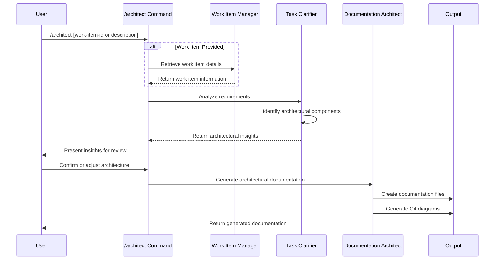

## PURPOSE

Generate comprehensive architectural documentation for a system, focusing on architectural overview, components, and design patterns without implementation details.

## EXECUTION

1. **Work Item Retrieval**:

   - If work item ID provided, use zzaia-work-item-manager to fetch details
   - If text description provided, use as direct input

2. **Requirements Analysis**:

   - zzaia-task-clarifier analyzes system requirements
   - Identify architectural components and service boundaries
   - Define technical decision framework

3. **Architectural Insights Review**:

   - Present architectural insights to user for approval
   - Show identified components, services, and design patterns
   - Highlight key architectural decisions
   - Wait for user confirmation before proceeding

4. **Documentation Generation**:
   - Use zzaia-documentation-architect to create architectural documentation
   - Generate documentation using predefined templates
   - Create C4 diagrams (Context and Container levels)
   - Document event flows for event-driven systems

## AGENTS

- **zzaia-work-item-manager**: Work item information retrieval
- **zzaia-task-clarifier**: Requirements analysis and architectural scoping
- **zzaia-documentation-architect**: Documentation generation and diagramming

## WORKFLOW



## DOCUMENTATION TEMPLATES

**MANDATORY**: Use those exclusive templates defined in the `.claude/templates/documentation/` folder: 

- `architecture-overview.md`
- `event-notifications.md` (if event-driven)
- `service-architecture.md`
- `service-data-models.md`

## OUTPUT LOCATIONS

- `docs/architecture-overview.md`
- `docs/event-notifications.md` (optional)
- `docs/{service-name}/`
  - `{service-name}-architecture.md`
  - `{service-name}-data-models.md`

## ACCEPTANCE CRITERIA

- Generates comprehensive architectural documentation
- Creates C4 Context and Container diagrams
- Defines service boundaries and interactions
- Documents architectural decisions
- Provides high-level system overview
- Do not add implementation-specific details
- Be concise 
- Presents architectural insights for user review before documentation generation
- Allows user to confirm or adjust architecture before proceeding

## EXAMPLES

```bash
# With work item ID
/architect ADO-12345

# With text description
/architect "Build a scalable e-commerce platform"
```

## NOTES

- Focus exclusively on architectural aspects
- Use only architectural documentation templates
- Support work item and free-text inputs
- Generate complete architectural documentation
