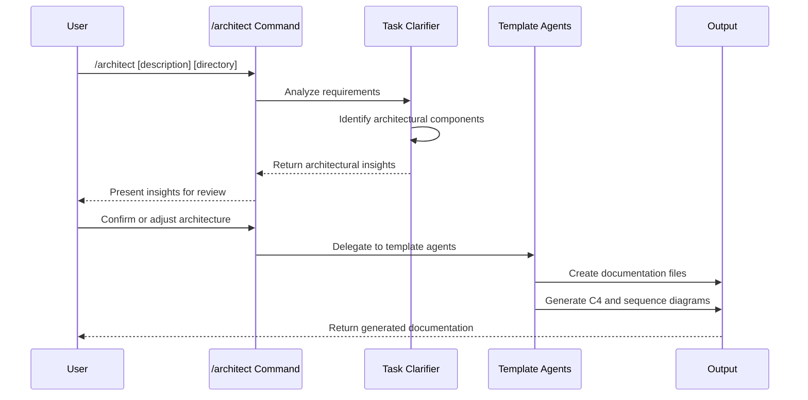

## PURPOSE

Generate comprehensive architectural documentation for a system, focusing on architectural overview, components, and design patterns without implementation details.

## EXECUTION

1. **Requirements Analysis**:

   - zzaia-task-clarifier analyzes the provided description
   - Identify architectural components and service boundaries
   - Define technical decision framework

2. **Architectural Insights Review**:

   - Present architectural insights to user for approval
   - Show identified components, services, and design patterns
   - Highlight key architectural decisions
   - Wait for user confirmation before proceeding

3. **Documentation Generation**:
   - Delegate to the appropriate template agents to generate each document
   - Create C4 diagrams (Context and Container levels)
   - Document event flows for event-driven systems
   - **NEVER** write code implementations or configurations
   - Focus on design decisions and not implementations

## WORKFLOW


```mermaid
sequenceDiagram
    participant U as User
    participant C as /architect Command
    participant TC as Task Clarifier
    participant TA as Template Agents
    participant O as Output

    U->>C: /architect [description] [directory]
    C->>TC: Analyze requirements
    TC->>TC: Identify architectural components
    TC-->>C: Return architectural insights
    C-->>U: Present insights for review
    U->>C: Confirm or adjust architecture
    C->>TA: Delegate to template agents
    TA->>O: Create documentation files
    TA->>O: Generate C4 and sequence diagrams
    O-->>U: Return generated documentation
```

## DOCUMENTATION AGENTS

**MANDATORY**: Use these template agents to generate each document:

- `template-architecture-overview` → `docs/architecture-overview.md`
- `template-service-architecture` → `docs/{service-name}-architecture.md`
- `template-service-data-model` → `docs/{service-name}-data-models.md`
- `template-event-notification` → `docs/event-notifications.md` (if event-driven)

## ACCEPTANCE CRITERIA

- Generates comprehensive architectural documentation
- Creates C4 Context and Container diagrams
- Defines service boundaries and interactions
- Documents architectural decisions
- Provides high-level system overview
- Do not add implementation-specific details
- Be concise
- Presents architectural insights for user review before documentation generation
- Allows user to confirm or adjust architecture before proceeding

## EXAMPLES

```bash
/architect "Build a scalable e-commerce platform" ./workspace/ecommerce.worktrees/master
```

## NOTES

- Focus exclusively on architectural aspects
- Delegate all document generation to template agents
- Generate complete architectural documentation
