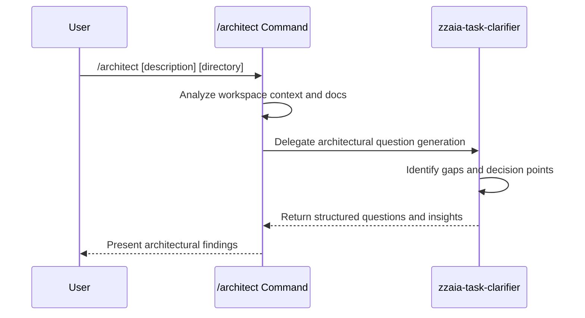

## PURPOSE

Explore architecture concepts and surface clarifying questions using `zzaia-task-clarifier`. Analyzes available context — documentation, work items, and workspace implementations — to identify architectural gaps, decisions needed, and areas requiring deeper understanding. 

## EXECUTION

1. **Context Analysis**: Gather and analyze all available input
   - Read provided description or work item context
   - Explore workspace directory for existing implementations and patterns
   - Scan available documentation and ADRs
   - Identify technology stack, service boundaries, and integration points

2. **Architectural Question Generation**: Use `zzaia-task-clarifier` to
   - Surface architectural concerns and decision gaps
   - Generate clarifying questions grouped by concern (scalability, integration, data, security, etc.)
   - Identify missing context that affects architectural decisions
   - Highlight conflicts or inconsistencies found in existing code or docs

3. **Presentation**: Deliver structured findings to the user
   - Organize questions by architectural concern category
   - Reference specific files, patterns, or work items where relevant
   - Suggest areas for deeper investigation

## DELEGATION

**MANDATORY**: Always invoke the agents defined in this command's frontmatter for their designated responsibilities. Never skip, replace, or simulate their behavior directly.

- `zzaia-task-clarifier` — Generate relevant and clarifying architectural questions based on context analysis

## WORKFLOW


```mermaid
sequenceDiagram
    participant U as User
    participant C as /architect Command
    participant TC as zzaia-task-clarifier

    U->>C: /architect [description] [directory]
    C->>C: Analyze workspace context and docs
    C->>TC: Delegate architectural question generation
    TC->>TC: Identify gaps and decision points
    TC-->>C: Return structured questions and insights
    C-->>U: Present architectural findings
```

## ACCEPTANCE CRITERIA

- Surfaces specific, contextual architectural questions
- References workspace patterns and existing implementations
- Groups questions by architectural concern
- Identifies gaps and decision points clearly
- Does NOT generate documentation artifacts
- Does NOT delegate to template agents

## EXAMPLES

```
/architect --work-description "Multi-tenant SaaS with microservices"
/architect --work-directory ./workspace/payments.worktrees/master
/architect --work-description "Event-driven order processing" --work-directory ./workspace/orders.worktrees/feature/checkout
```
