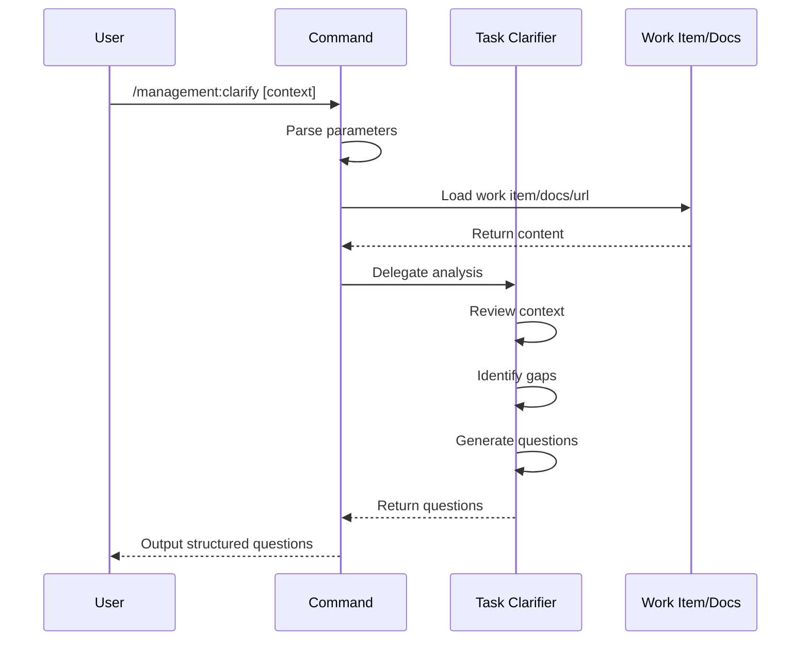

## PURPOSE

Conduct critical analysis of current context (task, work item, description, or plan) acting as an outside observer to identify inconsistencies, missing concepts, ambiguities, and knowledge gaps. Generate relevant questions that close understanding gaps, increase domain knowledge reach, deepen concept exploration, validate assumptions, and challenge scope and edge cases.

## EXECUTION

1. **Input Analysis**: Gather all provided context from parameters, documents, URLs, and work items

   - Consolidate free-text context
   - Retrieve work item details if provided
   - Load document and URL content

2. **Critical Review**: Examine context for gaps and inconsistencies

   - Identify unstated dependencies
   - Locate ambiguous requirements
   - Detect scope boundaries
   - Surface domain concept gaps

3. **Question Generation**: Create structured questions organized by concern area

   - Scope clarity and boundaries
   - Dependencies and integrations
   - Edge cases and error handling
   - Non-functional requirements
   - Domain concepts and assumptions
   - Risks and mitigation

## DELEGATION

**MANDATORY**: Invoke `zzaia-task-clarifier` to conduct the analysis and generate questions. Never simulate or replace this agent.

- `zzaia-task-clarifier` — Analyze requirements, identify gaps, generate critical questions

## WORKFLOW



## ACCEPTANCE CRITERIA

- Questions organized by concern area (Scope, Dependencies, Edge Cases, Non-Functional Requirements, Domain Concepts, Risks)
- No implementation decisions or recommendations provided
- All questions are critical and relevant to task quality
- Output formatted as numbered list by concern category

## EXAMPLES

```
/management:clarify --context "We need to implement a multi-tenant notification service"

/management:clarify --work-item 2001

/management:clarify --context "Refactor the payment gateway" --doc ./docs/spec.md --url https://docs.stripe.com/api

/management:clarify --context "Build a real-time dashboard" --work-item 1234
```

## OUTPUT

- Structured numbered list of critical questions
- Questions grouped by concern area
- No implementation recommendations
