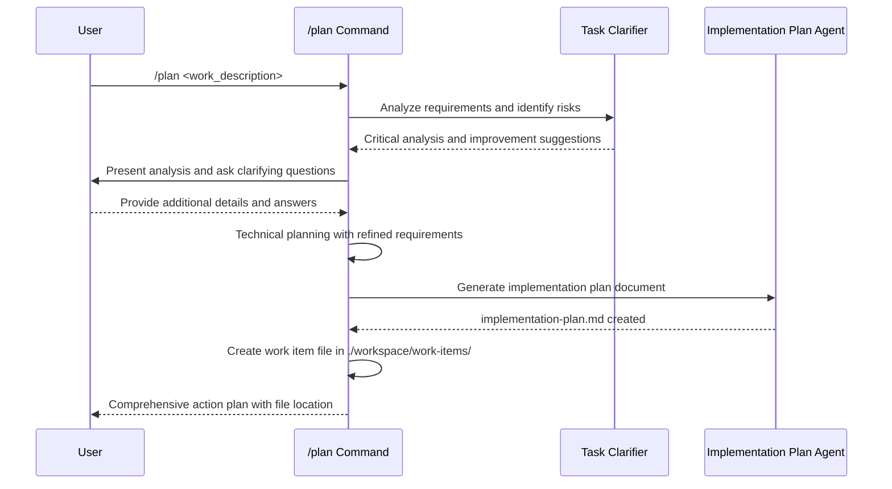

## PURPOSE

Generate or update comprehensive, actionable plans for user-requested work by analyzing requirements, with detailed phase breakdown, risk assessment, and implementation strategy. Serves as a pre-development planning step before using `/develop` command.

## EXECUTION

1. **Initial Requirements Analysis**

   - Use zzaia-task-clarifier for rigorous problem analysis
   - Identify involved projects, applications and architectural concerns
   - Generate critical questions and risk assessments
   - Receive suggestions for plan improvements

2. **User Interaction & Clarification**

   - Present task clarifier analysis and recommendations
   - Ask clarifying questions based on agent feedback
   - Gather additional requirements and constraints
   - Refine scope and success criteria with user input

3. **Technical Planning & Documentation**

   - Review existing implementations and architecture
   - Generate architecture plan through direct analysis
     - Identify application layers that must be implemented
     - Identify all patterns, tools, packages and SDKs that will be used
     - Identify the communication interface between applications
   - Generate step-by-step implementation plan
     - Identify steps that can be executed in parallel
     - Identify steps that must be executed sequentially
     - Keep all steps related to one application ALWAYS as sequential
     - Keep multi-application steps ALWAYS as parallel
   - No need to write code in documentations

4. **Plan Finalization**

   - Delegate to `zzaia-implementation-plan` to generate the master plan document
   - Generate comprehensive implementation plan with:
     - Phase hierarchy with Gantt chart
     - Parallel vs sequential execution strategy
     - Team structure and resource allocation
     - Success criteria and risk mitigation
     - Timeline summary and next steps
   - Create service-specific implementation plans for each application
   - Display the overall information in prompt
   - Estimate agentic developing effort, complexity, and resource requirements

5. **User Interaction & Improvements**

   - Ask if user has any improvements or rectifications
   - Refine the plan and documents with user input

## AGENTS

- **zzaia-task-clarifier**: Critical analysis, problem understanding, and improvement recommendations (analysis-only, no file creation)
- **zzaia-implementation-plan**: Master implementation plan document generation
- **zzaia-service-architecture**: Per-service architecture documentation (when needed)

## WORKFLOW



## EXAMPLES

```bash
# Plan from user description
/plan implement user authentication system

# Plan infrastructure work
/plan migrate database to new server

# Plan documentation project
/plan create API documentation for microservices
```

## DOCUMENTATION AGENTS

**MANDATORY**: Use these template agents to generate each document:

- `zzaia-implementation-plan` → `./workspace/work-items/<WorkItemName>/implementation-plan.md`
- `zzaia-service-architecture` → `./workspace/work-items/<WorkItemName>/<service-name>/<service-name>-architecture.md` (if needed)

## OUTPUT

- Interactive clarification session with user
- Critical analysis and risk assessment from task clarifier
- Comprehensive implementation plan with phase breakdown
- Implementation strategy with parallel/sequential execution
- Resource requirements and time estimates
- Service-specific implementation plans
- All documentation generated via template agents
