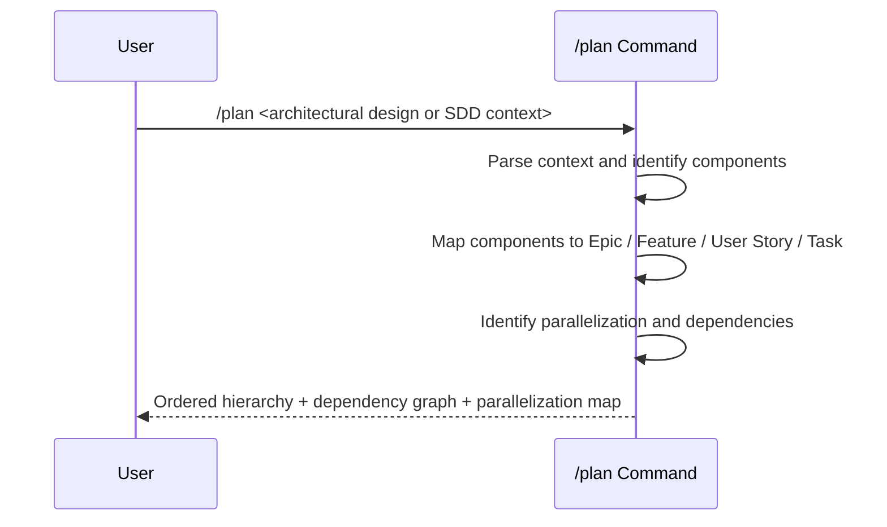

## PURPOSE

Decompose an architectural design or SDD context into a parallelizable agile work-item hierarchy (Epic → Feature → User Story → Task) for human or agent team execution. Produces a structured plan with dependency graph and parallelization map.

## EXECUTION

1. **Context Analysis**: Understand the input
   - Parse the provided architectural design, SDD, or description
   - Identify system components, bounded contexts, and service boundaries
   - Map components to agile granularity levels (Epic → Feature → User Story → Task)

2. **Hierarchy Decomposition**: Break down into work items
   - **Epics**: System-level capabilities aligned to bounded contexts
   - **Features**: Component-level deliverables per service or domain area
   - **User Stories**: Functional behaviors from actor perspective
   - **Tasks**: Implementation units designed as independent pull requests where possible

3. **Parallelization and Dependency Mapping**
   - Identify parallelization opportunities: independent work items that can be developed concurrently
   - Map sequential dependencies: items that must complete before others can start (`consumes-from`)
   - Define collaboration boundaries: related items that share context or interfaces (`related`)
   - Balance parallelization vs. collaboration: maximize concurrency while preserving team coordination points

4. **Plan Output**
   - Ordered work-item hierarchy with Epic → Feature → User Story → Task breakdown
   - Dependency graph showing `consumes-from` and `related` relationships
   - Parallelization map indicating which items can run concurrently
   - Sequence groups: waves of work that can be executed in parallel within each wave

## WORKFLOW



## ACCEPTANCE CRITERIA

- Full Epic → Feature → User Story → Task hierarchy produced
- Each leaf Task scoped as an independent pull request where possible
- All `consumes-from` dependencies explicitly identified
- All `related` collaboration boundaries explicitly identified
- Parallelization map groups tasks into concurrent execution waves
- No clarifying questions — delegates to `/management:clarify` for that
- No architectural decisions — delegates to `/management:architect` for that

## EXAMPLES

```
/plan "Payment service with checkout, refund, and webhook handling aligned to DDD bounded contexts"
/plan "Notification microservice: email, SMS, push — event-driven, multi-tenant"
```

## OUTPUT

- Work-item hierarchy: Epic → Feature → User Story → Task
- Dependency graph (`consumes-from`, `related`)
- Parallelization map with concurrent execution waves
- Estimated team/agent parallelism capacity per wave
