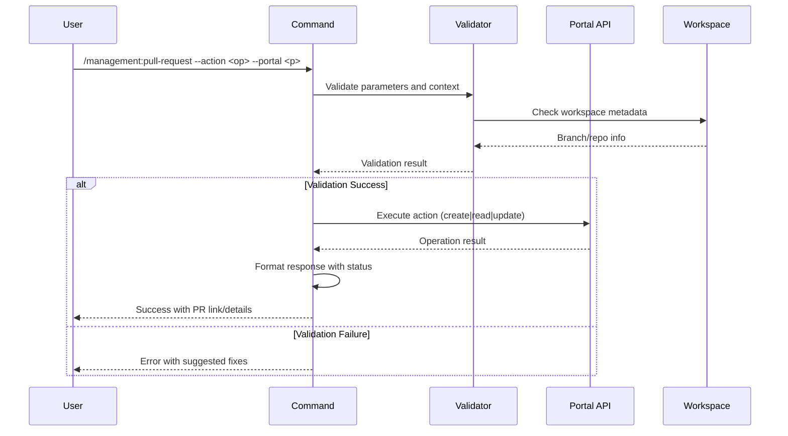

## PURPOSE

Unified pull request management across Azure DevOps and GitHub with support for creation, retrieval, and updates. Enables context-aware PR operations, work item linking, reviewer management, and code review publishing.

## EXECUTION

1. **Validation Phase**: Validate parameters and portal compatibility
   - Verify action is one of: create, read, update
   - Confirm portal is azure or github
   - Validate required fields based on action type
   - Check branch existence for create operations
   - Verify work item exists in Azure DevOps (if provided)

2. **Portal-Specific Operations**: Execute action with appropriate tooling
   - **Azure DevOps**: Use mcp__azure-devops__repo_* tools for all operations
   - **GitHub**: Use GitHub MCP tool for all operations
   - Retrieve context from workspace metadata when available
   - Apply defaults for target branch (main/master)

3. **Execution & Confirmation**: Perform operation and return results
   - Create: Generate PR and return link with ID
   - Read: Fetch PR details and format for review
   - Update: Apply changes and confirm completion
   - Publish reviews when requested
   - Apply PR templates to description
   - Link work items automatically (Azure DevOps)

## AGENTS

- **zzaia-code-reviewer**: Multi-repository coordination and branch validation

## WORKFLOW



## ACCEPTANCE CRITERIA

- Parameters validated before execution with clear error messages
- Azure DevOps and GitHub operations succeed independently
- PR creation returns direct link with ID confirmation
- PR read operation fetches and formats current state accurately
- PR update operations modify all requested fields atomically
- Work item linking works automatically for Azure DevOps
- Reviewer assignment succeeds for both portals
- Labels applied correctly on GitHub; tags applied on Azure DevOps
- Code review publishing executes when requested
- Context-aware defaults applied from workspace metadata
- All operations logged with timestamp and status indicators

## EXAMPLES

```
/management:pull-request --action create --portal azure --project MyProject --repo MyRepo --from-branch feature/new-feature --to-branch main --title "Add new feature" --description "Implements feature X" --work-item 123

/management:pull-request --action read --portal github --project MyOrg --repo my-repo --pr-id 45

/management:pull-request --action update --portal azure --project MyProject --repo MyRepo --pr-id 78 --reviewers user1@example.com,user2@example.com --labels "ready-for-review,high-priority"

/management:pull-request --action update --portal github --project MyOrg --repo my-repo --pr-id 12 --title "Updated title" --template true

/management:pull-request --action create --portal github --project MyOrg --repo my-repo --from-branch bugfix/issue-123 --to-branch develop --title "Fix critical bug" --labels "bugfix,urgent" --reviewers reviewer1,reviewer2
```

## OUTPUT

- **Status Indicator**: ✅ Success | ⚠️ Warning | ❌ Error
- **PR Creation**: ID, direct link, work item link (Azure only), confirmation
- **PR Read**: Current state, reviewers, labels/tags, linked items, diff statistics
- **PR Update**: Changed fields confirmation, new reviewers, timestamp
- **Review Publishing**: Confirmation with comment count and status
- **Errors**: Validation failures with specific fix suggestions
- **Batch Operations**: Summary of all operations with individual statuses
