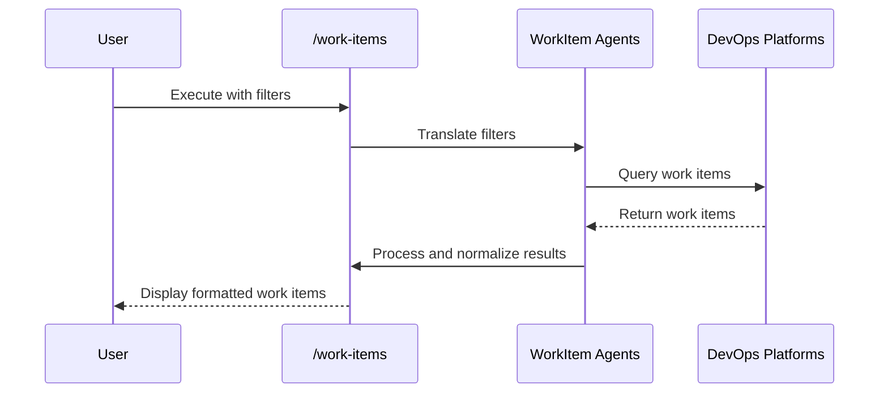

## PURPOSE

Provide a unified interface for retrieving and managing work items across multiple DevOps platforms, enabling developers to quickly access and filter work item information.

## EXECUTION

1. **Platform Detection**

   - Automatically detect available work item platforms
   - Use configured credentials from workspace configuration
   - Fallback to specified platform if provided

2. **Work Item Retrieval**

   - Connect to selected platform's API via MCP TOOL
   - Apply provided filters sequentially
   - Retrieve work items matching filter criteria

3. **Output Processing**
   - **List View**: Format multiple results in standardized CLI-friendly table
   - **Detail View**: Display complete work item information when a specific work item is specified
   - Normalize work item attributes across platforms
   - Handle platform-specific metadata

## WORKFLOW



## ACCEPTANCE CRITERIA

- Successfully connect to at least one DevOps platform
- Apply all specified filters correctly
- Return work items in consistent format
- Handle platform-specific variations
- Provide clear error messages for configuration issues

## EXAMPLES

```bash
# List recent project work items
/work-items --project "Finance" --limit 10

# Find specific work item (detailed view)
/work-items --id 46104

# Filter by assignee and status
/work-items --assignee "john.doe" --status "Active"

# Time-based filtering
/work-items --since "2025-09-01" --project "Crypto Hub"

# Specify platform explicitly
/work-items --platform azure --project "Engineering"
```

## OUTPUT FORMAT

### List View (Multiple Work Items)

```
PLATFORM  ID     TITLE                      STATUS   ASSIGNEE   UPDATED
---------------------------------------------------------------
Azure     46104  Implement OAuth Flow       Active   john.doe   2025-09-10
GitHub    1205   Fix Authentication Bug     Open     jane.smith 2025-09-08
GitLab    9876   Update Documentation       Closed   team-lead  2025-09-05
```

### Detailed View

- Complete work item information display

## CONFIGURATION REQUIREMENTS

- Platform-specific API credentials stored in secure workspace configuration
- OAuth/Personal Access Token support
- Extensible plugin architecture for new platforms
