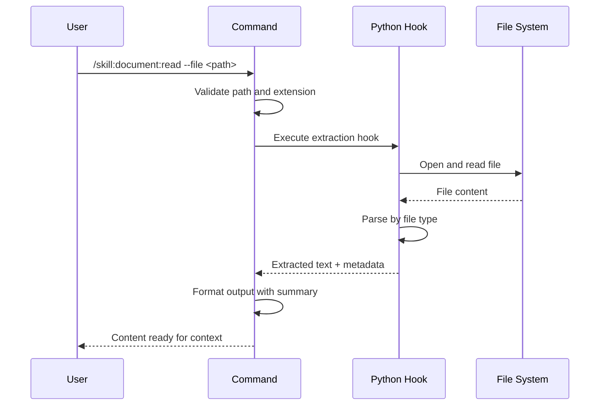

## PURPOSE

Extract structured text content from PDF and Word documents to reference in conversation context. Supports batch reading of document pages/sections with metadata headers.

## EXECUTION

1. **Validate Input**: Check file path, verify supported extension (.pdf or .docx)

   - Confirm file exists and is readable
   - Validate file extension
   - Report unsupported formats gracefully

2. **Extract Content**: Run `.claude/scripts/extract-document.py` to parse document

   - PDF: Extract text from all pages using pypdf
   - DOCX: Extract from paragraphs and tables using python-docx
   - Preserve structural information

3. **Present Results**: Output document metadata and content summary

   - Filename and location
   - Page count (PDF) or section count (DOCX)
   - Total character count
   - Full extracted text

## DELEGATION

**MANDATORY**: Always invoke the agents defined in this command's frontmatter for their designated responsibilities. Never skip, replace, or simulate their behavior directly.

- `zzaia-document-specialist` — Extract and structure content from PDF and Word documents

## WORKFLOW



## ACCEPTANCE CRITERIA

- Extracts all text from PDF files with page markers
- Extracts paragraphs and tables from DOCX files with section markers
- Displays document metadata (filename, type, item count, character count)
- Handles missing files with clear error messages
- Handles unsupported formats with format guidance
- Reports missing dependencies with installation instructions
- Output is plain text suitable for conversation context injection

## EXAMPLES

```
/skill:document:read --file ~/projects/report.pdf
/skill:document:read --file ./contract.docx
/skill:document:read --file /absolute/path/document.pdf --summary
```

## OUTPUT

- Document metadata header (filename, type, count, size)
- Full extracted text with page/table separators
- Section markers for organizational clarity
- Plain text format for context injection
