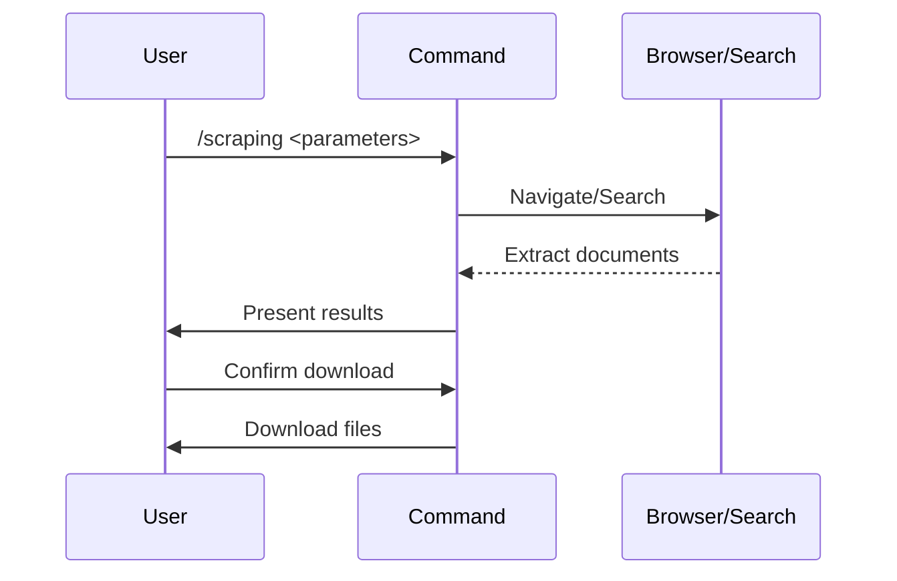

## PURPOSE

Discover and extract PDF/Word documents from web sources using browser automation (Playwright) or web search.

## EXECUTION

1. **Strategy**: Playwright for form-based sites, WebSearch/WebFetch for static sites
2. **Automation**: Navigate, fill forms, submit, extract links via browser_run_code
3. **Extraction**: Parse document URLs and metadata, apply filters
4. **Confirmation**: Present results, download if user confirms

## DELEGATION

**MANDATORY**: Always invoke the agents defined in this command's frontmatter for their designated responsibilities. Never skip, replace, or simulate their behavior directly.

- `zzaia-document-specialist` — Discovers and downloads PDF/Word documents using Playwright and Tavily MCP tools

## WORKFLOW



## ACCEPTANCE CRITERIA

- Prioritizes Playwright for interactive sites, fallback to WebSearch
- Discovers PDF/Word documents with metadata extraction
- Applies filters, requires user confirmation for downloads
- Handles errors gracefully with meaningful messages

## EXAMPLES

```bash
# Form-based site with filters
/skill:document:scraping url=https://site.com/search filters='{"term": "value"}'

# Web search with download
/skill:document:scraping search="research papers 2025" download=true output-path=/workspace/docs

# URL without download
/skill:document:scraping url=https://site.com/resources download=false
```

## OUTPUT

- Document table with metadata (title, type, size, URL)
- Confirmation prompts and download progress
- Summary statistics and error logs
