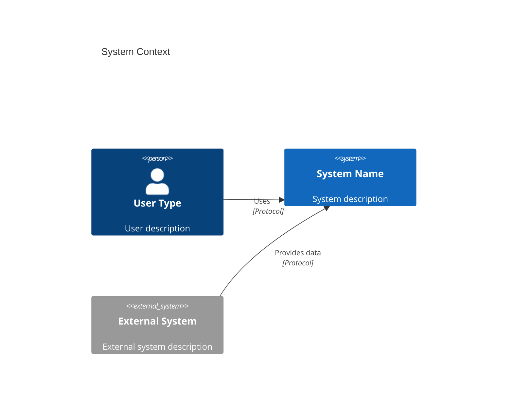
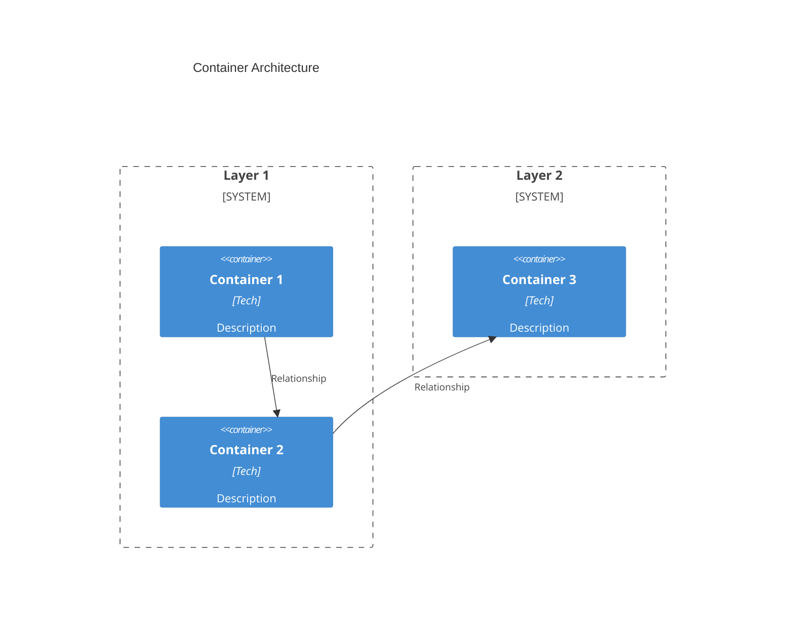

# [Project Name] - Architecture Overview

[Brief system description and architectural approach]

---

### ADR 001: [Decision Title]

**Decision**: [What was decided]

[Details in bullet points]

**Rationale**: [Why this decision was made and its benefits]

---

### ADR 002: [Next Decision]

[Follow same pattern]

---

## C4 Context Diagram



## C4 Container Diagram



## Project Structure

```
[ProjectName]/
├── src/
├── deploy/
├── docs/
└── tests/
```

## Architecture Components

### [Component Category]
- **[Component Name]**: [Brief description] ([Technologies])

### [Platform/Infrastructure]
- **[Infrastructure Component]**: [Brief description]

## Technology Stack

| Layer | Technologies |
|-------|-------------|
| [Layer] | [Technologies] |

## Related Documentation

- [Doc Title](path/to/doc.md) - Description
