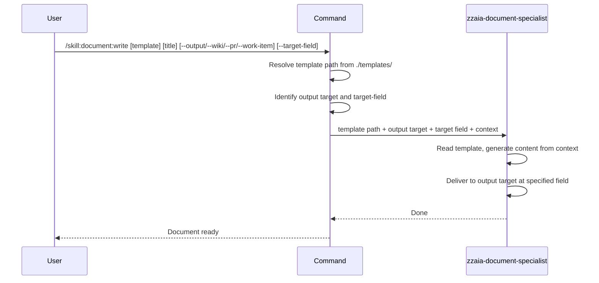

## PURPOSE

Select a documentation template from `./templates/`, generate content from conversation context following the template structure, and deliver to the requested output target.

## EXECUTION

1. **Select Template**: Identify or ask which template to use

   | Template | Use when |
   |----------|----------|
   | `architecture-overview` | Documenting the high-level design of a system or platform spanning multiple services |
   | `service-architecture` | Documenting a single service SDD — bounded context, API contracts, ADRs, data model |
   | `service-data-model` | Documenting entities, aggregates, value objects, and relationships for a domain model |
   | `event-notification` | Documenting domain events, message contracts, and event-driven integration patterns |
   | `integration-tests-plan` | Documenting test scenarios for API/service integration testing with Given/When/Then |
   | `implementation-plan` | Documenting a step-by-step implementation plan for a feature or task |
   | `test-result-report` | Documenting test results per step with status, evidence, findings, and bug summary |
   | `pull-request-review` | Documenting pull request review findings as a numbered list of issues with severity, location, and suggested fix |
   | `bdd-scenarios` | Documenting Behavior Driven Design scenarios with Feature, Background, and Given/When/Then steps |

2. **Select Output Target and Field**: Identify from flags or ask

   | Flag | Target | `--target-field` options | Default field |
   |------|--------|--------------------------|---------------|
   | `--output <path>` | Local markdown file | — | — |
   | `--wiki` | Azure DevOps Wiki page | — | — |
   | `--pr <id>` | Pull request | `description`, `comment` | `description` |
   | `--work-item <id>` | Work item | `description`, `acceptance-criteria`, `discussion`, `comment` | `discussion` |

3. **Apply Target Field Rule**:
   - `description` — sets the main description field (use only when creating new work items or setting a PR description)
   - `acceptance-criteria` — sets the acceptance criteria field of a work item
   - `discussion` — posts as a new discussion thread (default for `--work-item`)
   - `comment` — posts as a comment on an existing thread

4. **Adapt Format to Target**: Keep the same template structure and sections for all targets. When the target has partial markdown support (`--work-item`):
   - Preserve all headings, tables, bullet points, and code blocks
   - Skip mermaid diagrams — replace with a plain-text summary if relevant
   - Do not alter section order or omit content

5. **Invoke Agent**: Call `zzaia-document-specialist` with template path, output target, target field, and format constraints

## DELEGATION

**MANDATORY**: Always invoke the agents defined in this command's frontmatter. Never skip or simulate their behavior.

- `zzaia-document-specialist` — reads template, generates content from conversation context, delivers to output

## WORKFLOW



## EXAMPLES

```
/skill:document:write architecture-overview "System Architecture" --output docs/architecture.md
/skill:document:write service-architecture "Payment Service" --wiki
/skill:document:write service-data-model "Order Entity" --output docs/data-model.md
/skill:document:write event-notification "Payment Events" --pr 42 --target-field description
/skill:document:write service-architecture "User Service SDD" --work-item 1234 --target-field discussion
/skill:document:write integration-tests-plan "Checkout Flow Tests" --work-item 1234 --target-field acceptance-criteria
/skill:document:write implementation-plan "Add Order Status Endpoint" --work-item 1234 --target-field discussion
/skill:document:write test-result-report "Sprint 12 E2E Results" --work-item 2001 --target-field discussion
/skill:document:write pull-request-review "PR #42 Review" --pr 42 --target-field comment
/skill:document:write bdd-scenarios "Order Checkout Scenarios" --work-item 1234 --target-field acceptance-criteria
```

## OUTPUT

- Local markdown file, Wiki page, PR field, or work item field (discussion, description, acceptance-criteria, or comment)
