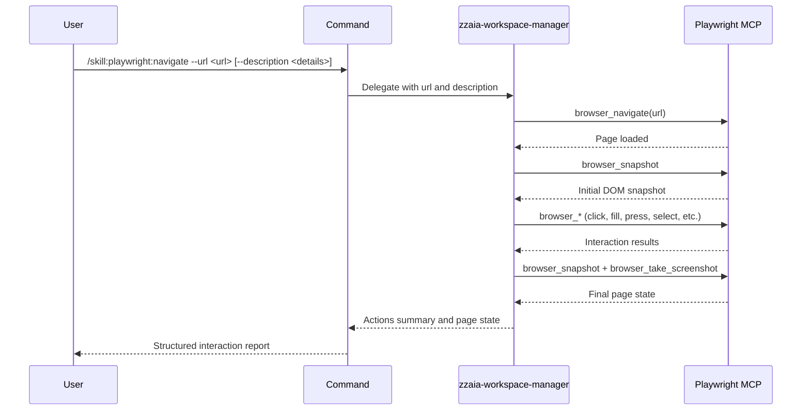

## PURPOSE

Navigate to a specific URL using Playwright MCP and perform interactions on the page as described. Supports clicks, form fills, key presses, selections, screenshots, and DOM inspection.

## EXECUTION

1. **Navigate** — Open or reuse a browser tab and navigate to `--url`
2. **Snapshot** — Capture initial DOM/accessibility snapshot to understand page structure
3. **Interact** — Execute interactions derived from `--description` (click, fill, press, select, hover, drag, etc.)
4. **Verify** — Capture post-interaction snapshot and screenshot to confirm result
5. **Report** — Return structured summary of actions taken and final page state

## DELEGATION

**MANDATORY**: Always invoke the agents defined in this command's frontmatter for their designated responsibilities. Never skip, replace, or simulate their behavior directly.

- `zzaia-workspace-manager` — Executes all Playwright MCP tool calls for navigation and page interaction

## WORKFLOW



## ACCEPTANCE CRITERIA

- Navigates to the provided `--url` successfully
- Executes interactions described in `--description`
- Captures before/after page state via snapshots and screenshots
- Returns structured report of all actions taken and final page state

## EXAMPLES

```
/skill:playwright:navigate --url https://localhost:3000
```

```
/skill:playwright:navigate --url https://localhost:3000/login --description "Fill username admin and password secret, then click submit"
```

```
/skill:playwright:navigate --url https://example.com/form --description "Select option 'Brazil' from country dropdown and submit the form"
```

## OUTPUT

- Navigation confirmation (URL, page title)
- List of interactions performed
- Before/after DOM snapshots
- Final page screenshot
