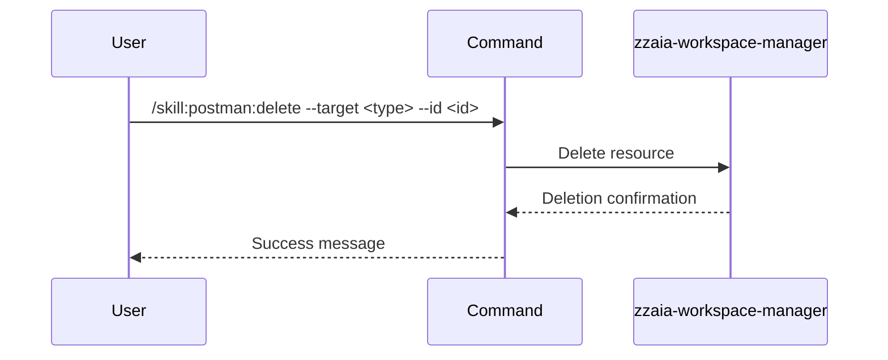

## PURPOSE

Delete an existing Postman resource by ID or name. Removes the resource entirely from the workspace.

## EXECUTION

1. **Identify** the resource type from `--target` and resource ID from `--id`
2. **Delete** the resource using Postman MCP
3. **Confirm** the deletion completion

## DELEGATION

**MANDATORY**: Always invoke the agents defined in this command's frontmatter for their designated responsibilities. Never skip, replace, or simulate their behavior directly.

- `zzaia-workspace-manager` — Delete resource via Postman MCP

## WORKFLOW



## ACCEPTANCE CRITERIA

- Resource is deleted from Postman workspace
- Deletion is confirmed and irreversible
- Deletion does not affect other resources
- Resource is no longer accessible

## EXAMPLES

```
/skill:postman:delete --target collection --id "collection-abc123"
```

```
/skill:postman:delete --target environment --id "staging" --description "Clean up staging environment after tests complete"
```

```
/skill:postman:delete --target request --id "Get Users"
```

```
/skill:postman:delete --target mock --id "mock-server-xyz"
```

## OUTPUT

- Deletion confirmation message
- Deleted resource ID and name
- Timestamp of deletion
