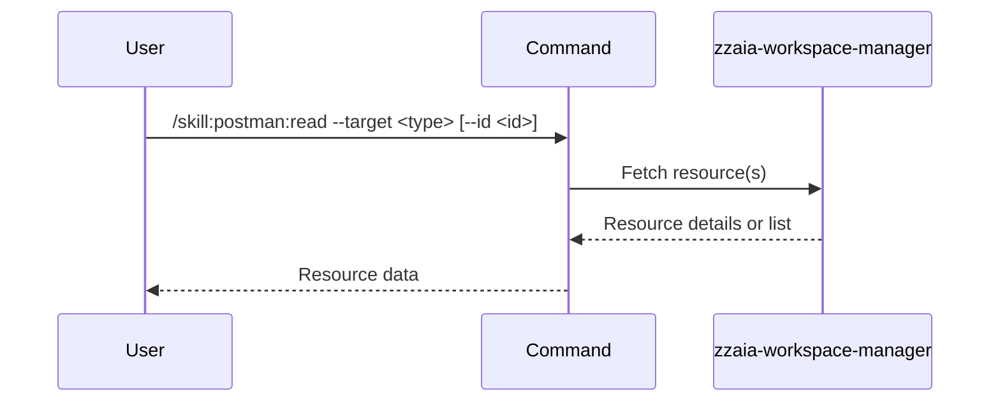

## PURPOSE

Read and list Postman workspace resources by type. Retrieves a single resource by ID or lists all resources of the specified type.

## EXECUTION

1. **Identify** the resource type from `--target`
2. **Check** if `--id` is provided (single resource) or omitted (list all)
3. **Fetch** the resource(s) using Postman MCP
4. **Return** resource details or list of resources

## DELEGATION

**MANDATORY**: Always invoke the agents defined in this command's frontmatter for their designated responsibilities. Never skip, replace, or simulate their behavior directly.

- `zzaia-workspace-manager` — Read resources via Postman MCP

## WORKFLOW



## ACCEPTANCE CRITERIA

- Single resource read returns full resource details
- List operation returns all resources of the type
- Resource properties are complete and accurate
- Nested structures (folders, requests within collections) are included

## EXAMPLES

```
/skill:postman:read --target collection
```

```
/skill:postman:read --target collection --id "collection-abc123"
```

```
/skill:postman:read --target environment --description "Get all environments to see available API configurations"
```

```
/skill:postman:read --target request --id "Get Users"
```

## OUTPUT

- For single resource: Full resource object with all properties
- For list: Array of resources with ID, name, and type
