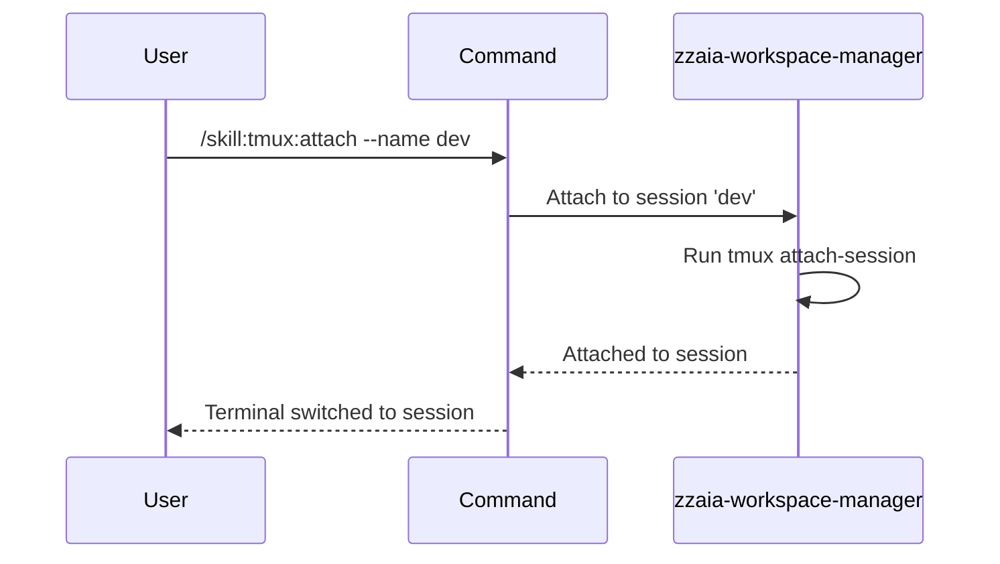

## PURPOSE

Attach to an existing tmux session by name or index, switching the active terminal to that session's context. Used to reconnect to previously created sessions.

## EXECUTION

1. **Validate**: Confirm the session name or index exists
2. **Attach**: Execute `tmux attach-session -t <name>`
3. **Verify**: Confirm attachment succeeded and terminal context switched
4. **Report**: Display the session details after attachment

## DELEGATION

**MANDATORY**: Always invoke the agents defined in this command's frontmatter for their designated responsibilities. Never skip, replace, or simulate their behavior directly.

- `zzaia-workspace-manager` — Manages tmux session attachment and terminal context switching

## WORKFLOW



## ACCEPTANCE CRITERIA

- Session name or index is provided
- Session exists in active sessions list
- Attachment command executes without error
- Terminal context switches to target session
- Confirmation includes session details

## EXAMPLES

```
/skill:tmux:attach --name dev
/skill:tmux:attach --name 0
/skill:tmux:attach --name build --description "reconnecting to build session"
```

## OUTPUT

- Confirmation of attachment
- Session name and window information
- Current pane status
