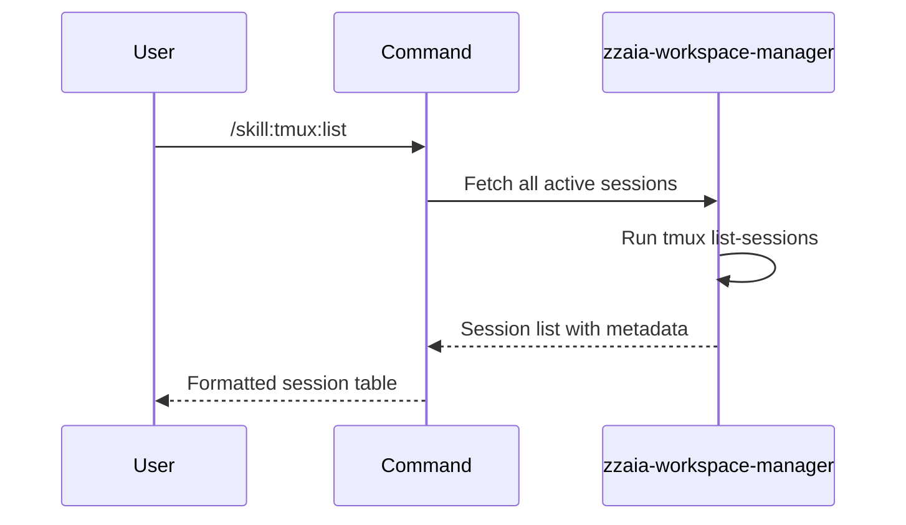

## PURPOSE

Retrieve and display all currently active tmux sessions with detailed information including session name, number of windows, status, and creation timestamp.

## EXECUTION

1. **Query**: Use `tmux list-sessions -F` to fetch all active sessions
2. **Format**: Parse session data to extract name, window count, and timestamp
3. **Display**: Present sessions in a tabular format with status indicators
4. **Filter**: Highlight attached vs. detached sessions

## WORKFLOW



## ACCEPTANCE CRITERIA

- All active sessions are listed
- Session names are displayed
- Window count per session is shown
- Session status (attached/detached) is indicated
- Creation timestamp is included where available
- Output is clearly formatted for readability

## EXAMPLES

```
/skill:tmux:list
/skill:tmux:list --description "check current active sessions"
```

## OUTPUT

- Table with columns: Session Name, Windows, Status, Created
- Summary count of total active sessions
- Indicators for which sessions have attached clients
