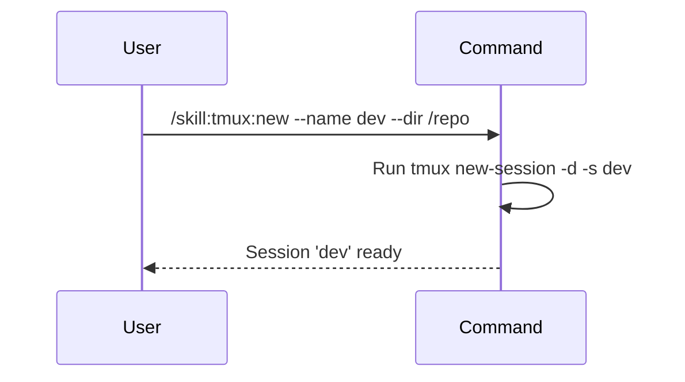

## PURPOSE

Create a new tmux session with a specified name, optional starting directory, and optional initial window name. The session can then be used for persistent terminal operations.

## EXECUTION

1. **Validate**: Check that the session name is provided and does not already exist
2. **Create**: Initialize a new tmux session with `tmux new-session -d -s <name> -x 120 -y 40`
3. **Configure**: If `--dir` is provided, set the session's working directory
4. **Name Window**: If `--window` is provided, rename the initial window
5. **Verify**: Confirm the session was created successfully

## WORKFLOW



## ACCEPTANCE CRITERIA

- Session name is provided and validated
- Session does not already exist
- Session is created with detached mode
- Starting directory is set if provided
- Window is renamed if provided
- Confirmation message shows session details

## EXAMPLES

```
/skill:tmux:new --name dev
/skill:tmux:new --name build --dir /workspace/project
/skill:tmux:new --name api --window server --dir /app
/skill:tmux:new --name monitor --description "monitoring session for health checks"
```

## OUTPUT

- Confirmation of session creation
- Session name, number of windows, and creation timestamp
- Working directory if specified
