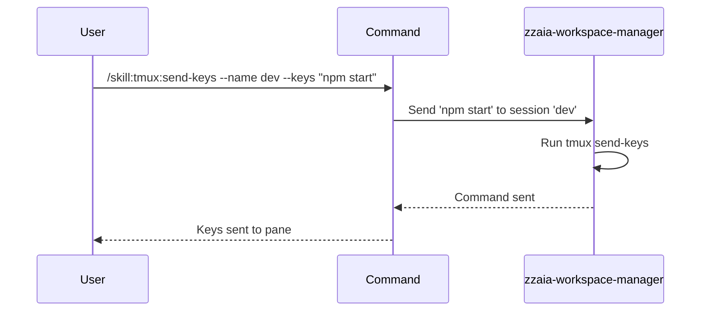

## PURPOSE

Send keyboard input or shell commands to a specific pane within a tmux session. Used to execute commands in the background or automate interactive terminal workflows.

## EXECUTION

1. **Validate**: Confirm the session and pane exist
2. **Prepare**: Parse the command string or keystroke sequence
3. **Send**: Execute `tmux send-keys -t <session>:<window>.<pane> <keys> Enter`
4. **Verify**: Confirm the keys were sent without error
5. **Report**: Provide confirmation of the command sent

## DELEGATION

**MANDATORY**: Always invoke the agents defined in this command's frontmatter for their designated responsibilities. Never skip, replace, or simulate their behavior directly.

- `zzaia-workspace-manager` — Sends commands to tmux panes and manages interactive terminal automation

## WORKFLOW



## ACCEPTANCE CRITERIA

- Session name is provided and exists
- Command string is provided and not empty
- Pane index is valid or defaults to current pane
- send-keys command executes without error
- Command is visible in the target pane
- Confirmation includes command sent and target pane

## EXAMPLES

```
/skill:tmux:send-keys --name dev --keys "npm start"
/skill:tmux:send-keys --name dev --keys "docker-compose up" --pane 0
/skill:tmux:send-keys --name build --keys "make test" --description "running tests in background"
/skill:tmux:send-keys --name monitor --keys "watch -n 1 'ps aux | grep node'" --pane 1
```

## OUTPUT

- Confirmation of command sent
- Target session and pane information
- Command text echoed for verification
