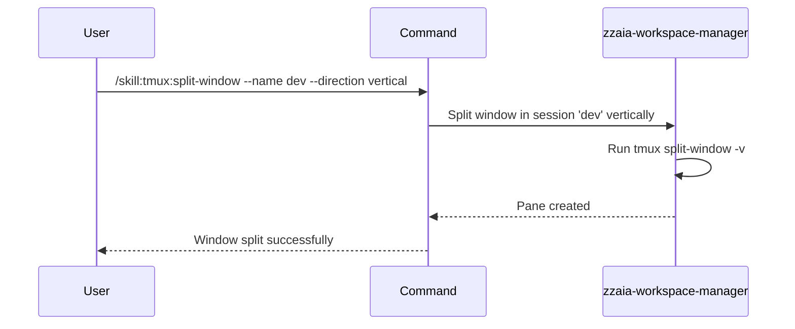

## PURPOSE

Split a tmux window into multiple panes either horizontally or vertically within a specified session and window. Allows for side-by-side or stacked terminal layouts.

## EXECUTION

1. **Validate**: Confirm the session and window exist
2. **Determine Direction**: Parse `--direction` or default to horizontal
3. **Split**: Execute appropriate split command based on direction
   - Horizontal: `tmux split-window -h -t <session>:<window>`
   - Vertical: `tmux split-window -v -t <session>:<window>`
4. **Verify**: Confirm the pane was created successfully
5. **Report**: Display the new pane layout

## DELEGATION

**MANDATORY**: Always invoke the agents defined in this command's frontmatter for their designated responsibilities. Never skip, replace, or simulate their behavior directly.

- `zzaia-workspace-manager` — Manages tmux window layouts and pane configuration

## WORKFLOW



## ACCEPTANCE CRITERIA

- Session name is provided and exists
- Direction is valid (horizontal or vertical) or defaults to horizontal
- Window index is valid or defaults to current window
- Split command executes without error
- New pane is created and displayed
- Confirmation shows new pane layout

## EXAMPLES

```
/skill:tmux:split-window --name dev
/skill:tmux:split-window --name dev --direction vertical
/skill:tmux:split-window --name dev --window 0 --direction horizontal
/skill:tmux:split-window --name build --description "splitting window for parallel builds"
```

## OUTPUT

- Confirmation of split operation
- New pane index and dimensions
- Updated window layout visualization
