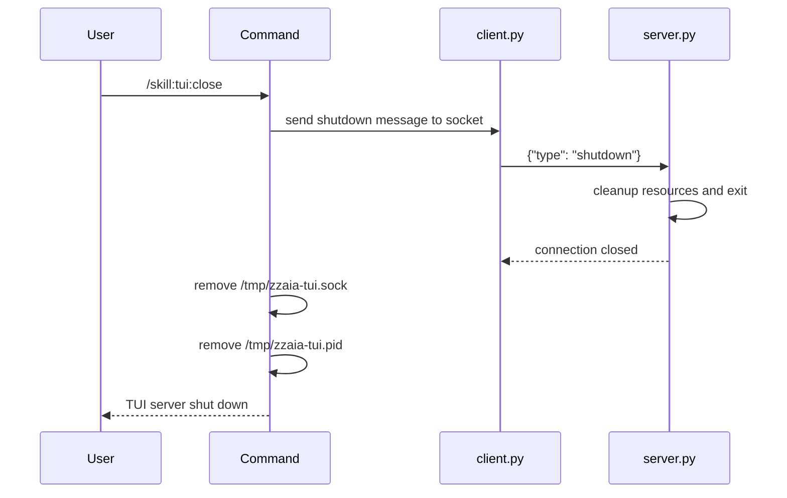

## PURPOSE

Gracefully shutdown the running TUI server by sending a shutdown signal via the Unix socket, then clean up socket and PID files.

## EXECUTION

1. **Send shutdown signal**: Use `client.py` to send `{"type": "shutdown"}` message to the socket
2. **Wait for exit**: Give the server process time to exit cleanly
3. **Clean up files**: Remove `/tmp/zzaia-tui.sock` and `/tmp/zzaia-tui.pid`

## DELEGATION

**MANDATORY**: Always invoke the agents defined in this command's frontmatter for their designated responsibilities. Never skip, replace, or simulate their behavior directly.

- `zzaia-workspace-manager` — Handle process termination and file cleanup

## WORKFLOW



## ACCEPTANCE CRITERIA

- Shutdown message sent successfully to socket
- Server process exits within timeout
- Socket file removed from filesystem
- PID file removed from filesystem
- No stray processes remain

## EXAMPLES

```
/skill:tui:close
/skill:tui:close --description "End debug session"
```

## OUTPUT

- Confirmation that TUI server has been shut down
- Socket and PID files cleaned up
- All resources released
