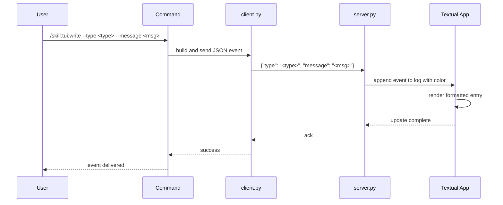

## PURPOSE

Send a structured event to the TUI via Unix socket. The event is rendered as a formatted log entry with appropriate color coding and formatting based on its type.

## EXECUTION

1. **Validate input**: Ensure `--type` is one of the allowed values and `--message` is provided
2. **Build JSON payload**: Create `{"type": "<type>", "message": "<message>"}`
3. **Connect and send**: Use `client.py` to send the payload to `/tmp/zzaia-tui.sock`

## DELEGATION

**MANDATORY**: Always invoke the agents defined in this command's frontmatter for their designated responsibilities. Never skip, replace, or simulate their behavior directly.

- `zzaia-workspace-manager` — Handle socket communication and event dispatch

## WORKFLOW



## ACCEPTANCE CRITERIA

- Event type validated against allowed types
- Message content captured in full
- JSON payload delivered to socket
- Event rendered in TUI with proper formatting
- Color coding applied per event type

## EVENT TYPES

| Type       | Color        | Symbol | Usage                          |
|------------|--------------|--------|--------------------------------|
| `info`     | White        | —      | Informational messages         |
| `success`  | Bold green   | ✅     | Successful operations          |
| `error`    | Bold red     | ❌     | Errors and failures            |
| `warning`  | Yellow       | ⚠️     | Warnings and cautions          |
| `agent`    | Bold cyan    | ▶      | Agent execution messages       |
| `tool`     | Yellow       | ⚙      | Tool invocation messages       |
| `markdown` | Rendered     | —      | Markdown formatted content     |

## EXAMPLES

```
/skill:tui:write --type info --message "Starting deployment"
/skill:tui:write --type success --message "Build completed successfully"
/skill:tui:write --type error --message "Connection timeout after 30s"
/skill:tui:write --type agent --message "Invoking code-reviewer agent"
/skill:tui:write --type markdown --message "# Heading\n\nSome **bold** text"
```

## OUTPUT

- Event logged in TUI with appropriate formatting
- Immediate visual feedback in the TUI pane
- Socket connection closed after delivery
