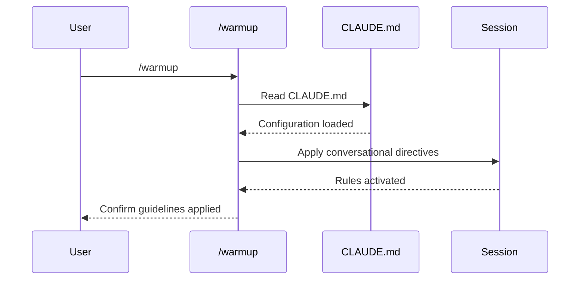

## PURPOSE

Establish session-wide conversational guidelines by reading CLAUDE.md and applying mandatory directives for concise, deep, judgment-free interactions.

## EXECUTION

1. **Load Configuration**: Read @CLAUDE.md from project root

2. **Apply Guidelines**: Set conversational rules for current session
   - Keep explanations brief and concise
   - Go deeper in subjects, avoid superficiality
   - No compliments or judgments
   - Follow agentic output style

3. **Confirm Setup**: Report configuration status and active rules

## WORKFLOW



## ACCEPTANCE CRITERIA

- CLAUDE.md file successfully read
- Conversational guidelines applied to session context
- Output confirms active rules without verbose explanation
- Session maintains concise, agentic communication style

## EXAMPLES

```
/warmup
/warmup verbose
```

## OUTPUT

Confirmation message showing:
- Configuration loaded
- Active conversational rules
- Session readiness status
