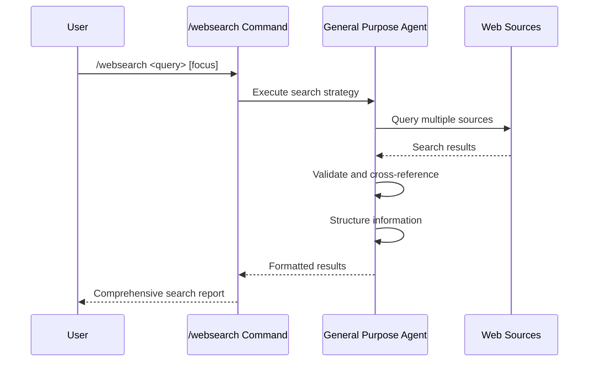

## PURPOSE

Provide standardized, unified web search protocol for comprehensive information gathering with quality validation and cross-referencing.

## EXECUTION

1. **Search Strategy**
   - Prioritize MCP search tools (Tavily, content extraction)
   - Use built-in WebSearch as fallback
   - Apply WebFetch for specific URLs

2. **Information Gathering**
   - Execute comprehensive web searches
   - Verify current information currency
   - Cross-reference multiple sources

3. **Quality Validation**
   - Assess source credibility and authority
   - Ensure information relevance
   - Document search methodology

## AGENTS

- **general-purpose**: Web search execution, content analysis, and information structuring

## WORKFLOW



## PARAMETERS

- `query`: Search query or research topic
- `focus`: Optional specific aspect or focus area for targeted research

## EXAMPLES

```bash
# General web search
/websearch "latest .NET 8 features"

# Focused research
/websearch "microservices architecture" focus="security best practices"

# Technical documentation
/websearch "Entity Framework Core migrations" focus="production deployment"
```

## OUTPUT

- Comprehensive search results with source attribution
- Information quality assessment and credibility ratings
- Cross-referenced findings from multiple perspectives
- Search methodology documentation
- Structured insights and key takeaways