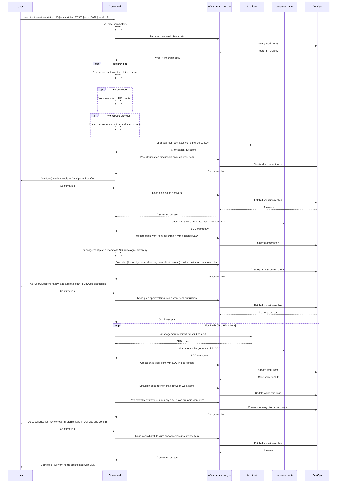

## PURPOSE

Orchestrate architectural documentation and work-item hierarchy creation for a given main work item using Specification Driven Design (SDD). Decomposes requirements into a parallelize hierarchy of work items, each with embedded SDD documentation at the appropriate abstraction level (Epic → Feature → User Story → Task). Enables human and agent teams collaboration through Azure DevOps discussions during the architectural design.


## EXECUTION

1. **Retrieve Work Item Chain**
   - Call `/devops:work-item` with `main-work-item` parameter to retrieve the full hierarchy
   - Collect Title, Description, Acceptance Criteria from each level (Epic → Feature → User Story → Task)
   - **MANDATORY** Main work item description must not be empty

2. **Gather Repository and Referenced Documentation**
   - Inspect local workspace repositories using the `Read` tool for file path references (source code, configs, existing docs)
   - Call `/document:read` for any local document file references (PDF, Word) found in work items or workspace
   - Call `/websearch` for any URL references found in work items
   - Enrich architectural context with retrieved repository structure and materials

3. **Generate Main Work Item Architecture**
   - Call `/management:architect` with main work item context and description parameter
   - Call `/devops:work-item` to post a discussion on the main work item with all clarification questions as a numbered list
   - **MANDATORY** Do NOT create child work items or update descriptions with architectural documentation before user responds

4. **Validate Main Work Item Documentation**
   - Use the tool **AskUserQuestion** to ask user to reply to the Azure DevOps discussion and confirm to continue
   - Call `/devops:work-item` to read all discussion answers from the main work item
   - Call `/devops:work-item` and `/document:write` to update main work item related description with finalized SDD documentation in markdown following the templates

5. **Plan Child Work Item Hierarchy**
   - Call `/management:plan` to decompose the finalized SDD into a parallelizable agile hierarchy:
     - Break architectural design into Features, User Stories, and Tasks aligned to SDD components
     - Identify parallelization opportunities: independent work items that can be developed concurrently
     - Map sequential dependencies: items that must complete before others can start (`consumes-from`)
     - Define collaboration boundaries: related items that share context or interfaces (`related`)
     - Balance parallelization vs. collaboration: maximize concurrency while preserving team coordination points
     - Output: ordered work-item plan with dependency graph and parallelization map
   - Call `/devops:work-item` to post the full plan (hierarchy, dependency graph, parallelization map) as a discussion on the main work item
   - **MANDATORY** Do NOT create any child work items before the user approves the plan

6. **Validate Plan**
   - Use **AskUserQuestion** to ask user to reply to the plan discussion in Azure DevOps and confirm to continue
   - Call `/devops:work-item` to read all plan approval/feedback from the main work item discussion

7. **Create Child Work Items**
   - For each child work item in the approved plan:
     - Call `/management:architect` to generate the SDD documentation at the appropriate granularity level
     - Call `/document:write` to produce the finalized SDD markdown
     - Call `/devops:work-item` to create the work item with the SDD documentation embedded in its description
   - Each level must have appropriate SDD granularity: Epic (system), Feature (component), User Story (functional), Task (implementation)
   - Leaf tasks must be designed as independent pull requests where possible
   - Call `/devops:work-item` to establish dependency links (`related`, `consumes-from`) between dependent items per the plan

8. **Validate Overall Architecture**
   - Call `/devops:work-item` to post a summary discussion on the main work item with the full created hierarchy, all child work item IDs, and any open architectural questions
   - Use **AskUserQuestion** to ask user to review the overall architecture in the Azure DevOps discussion and confirm to continue
   - Call `/devops:work-item` to read all answers from the main work item discussion

## DELEGATION

**MANDATORY**: Always invoke the agents defined in this command's frontmatter for their designated responsibilities. Never skip, replace, or simulate their behavior directly.

- `zzaia-work-item-manager` — Retrieve and manage work items in Azure DevOps, post discussions, and update descriptions
- `zzaia-task-clarifier` — Analyze and decompose requirements for architecture planning

## WORKFLOW



## ACCEPTANCE CRITERIA

- Main work item chain retrieved and understood
- Referenced documentation integrated into context
- Main work item SDD discussion posted before any structural changes
- Main work item description updated with finalized markdown SDD
- Work-item plan (hierarchy, dependency graph, parallelization map) posted as discussion on main work item
- Plan validated via DevOps discussion before any child work items are created
- Child work items created with SDD documentation embedded in descriptions from the start
- Dependency links established between child work items per the validated plan
- Overall architecture summary posted as discussion on main work item
- Overall architecture validated via DevOps discussion before completion
- Leaf-level tasks designed as independent, parallelizable pull requests

## KEY DESIGN PRINCIPLES

- **SDD Granularity**: Epic (system-level), Feature (component), User Story (functional), Task (implementation)
- **Discussion-First**: All architectural decisions validated via DevOps discussions before structural changes
- **Parallelization**: Leaf tasks designed as independent pull requests where possible
- **Dependency Tracking**: Work-item links establish explicit dependencies between tasks
- **Human Collaboration**: Architectural decisions integrated through DevOps discussion threads, not CLI alone

## EXAMPLES

```
/architect --main-work-item 2001 --description "Multi-tenant notification service with email, SMS, and push channels"

/architect --main-work-item 1850 --doc ./docs/requirements.pdf

/architect --main-work-item 2200 --description "Refactor payment gateway integration" --url https://docs.stripe.com/api --workspace ./workspace/payments.worktrees/master
```

## OUTPUT

- Phase completion status at each step
- Work item chain summary with hierarchy visualization
- SDD discussion thread links for main and child work items
- Finalized work item descriptions with embedded markdown SDD
- List of created child work items with IDs, types, and dependencies
- Parallelization map indicating which tasks can run concurrently
- Dependency graph showing consumes-from and related relationships
