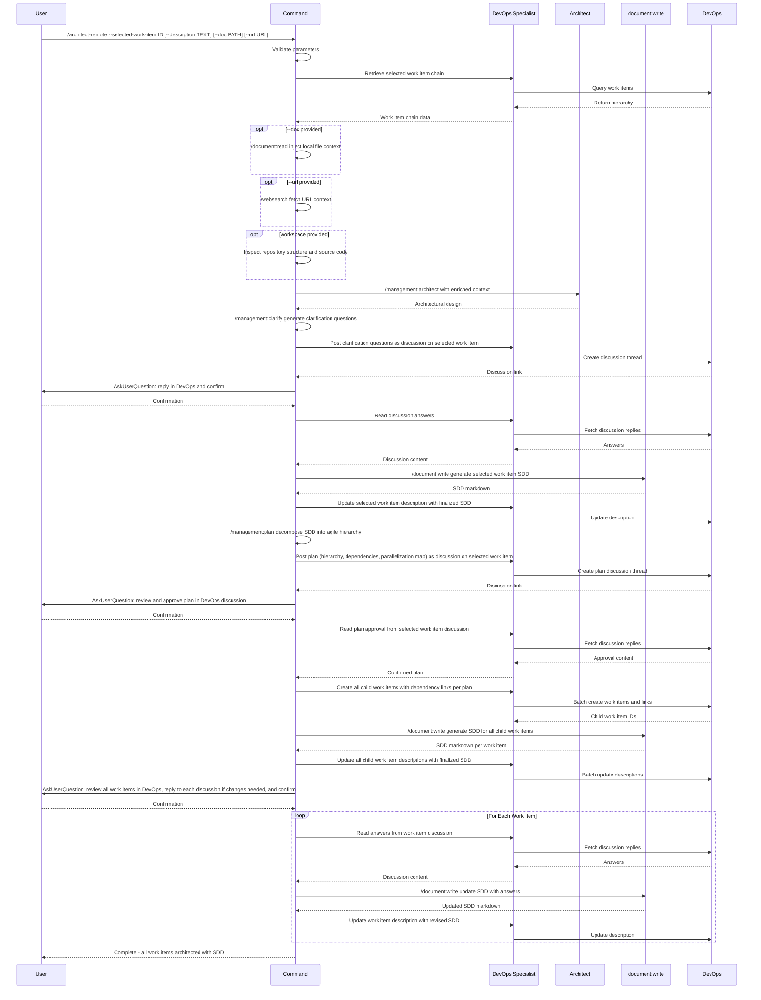

## PURPOSE

Orchestrate architectural documentation and work-item hierarchy creation for a given selected work item using Specification Driven Design (SDD). Decomposes requirements into a parallelize hierarchy of work items, each with embedded SDD documentation at the appropriate abstraction level (Epic → Feature → User Story → Task). Enables human and agent teams collaboration through Azure DevOps discussions during the architectural design.


## WORKFLOW PHASES 

1. **Retrieve Work Item Chain**
   - Call `/devops:work-item` with `selected-work-item` parameter to retrieve the full hierarchy
   - Collect Title, Description, Acceptance Criteria from each level (Epic → Feature → User Story → Task)
   - **MANDATORY** Selected work item description must not be empty

2. **Gather Repository and Referenced Documentation**
   - Inspect local workspace repositories using the `Read` tool for file path references (source code, configs, existing docs)
   - Call `/document:read` for any local document file references (PDF, Word) found in work items or workspace
   - Call `/websearch` for any URL references found in work items
   - Enrich architectural context with retrieved repository structure and materials

3. **Generate Selected Work Item Architecture**
   - Call `/management:architect` with context and description parameters to produce the architectural design
   - Call `/management:clarify --context` passing the architectural design output to generate critical clarification questions
   - Call `/devops:work-item` to post a discussion on the selected work item with all clarification questions as a numbered list
   - **MANDATORY** Do NOT create child work items or update descriptions with architectural documentation before user responds

4. **Validate Selected Work Item Documentation**
   - Use the tool **AskUserQuestion** to ask user to reply to the Azure DevOps discussion and confirm to continue
   - Call `/devops:work-item` to read all discussion answers from the selected work item
   - Call `/document:write` generate the finalized SDD documentation in markdown following the templates
   - Call `/devops:work-item` to update selected work item related description with finalized SDD documentation 

5. **Plan Child Work Item Hierarchy**
   - Call `/management:plan --work-description` passing the finalized SDD content to decompose it into a parallelizable agile hierarchy
   - Call `/devops:work-item` to post the full resumed plan (hierarchy, dependency graph, parallelization map) as a discussion on the selected work item
   - **MANDATORY** Do NOT create any child work items before the user approves the plan

6. **Validate Plan**
   - Use **AskUserQuestion** to ask user to reply to the plan discussion in Azure DevOps and confirm to continue
   - Call `/devops:work-item` to read all plan approval/feedback from the selected work item discussion

7. **Create Child Work Items**
   - Call `/devops:work-item` to create all work items with all establish dependency links (`related`, `consumes-from`) between dependent items per the plan 
   - Call `/document:write` to produce the finalized SDD markdown for all work items
   - Call `/devops:work-item` to update all work items related description with finalized SDD documentation 

8. **Validate Overall Architecture**
   - Use **AskUserQuestion** to ask user to review all work items in Azure DevOps, reply to each individual discussion if changes are needed, and confirm to continue
   - For each work item: call `/devops:work-item` to read answers from its individual discussion
   - Call `/document:write` to update the SDD with the answers for each respective work item
   - Call `/devops:work-item` to update each work item description with the revised SDD

## WORKFLOW



## ACCEPTANCE CRITERIA

- Selected work item chain retrieved and understood
- Referenced documentation integrated into context
- Selected work item SDD discussion posted before any structural changes
- Selected work item description updated with finalized markdown SDD
- Work-item plan (hierarchy, dependency graph, parallelization map) posted as discussion on selected work item
- Plan validated via DevOps discussion before any child work items are created
- Child work items created with SDD documentation embedded in descriptions from the start
- Dependency links established between child work items per the validated plan
- Overall architecture validated by user reviewing individual work item discussions before completion
- All work item SDDs updated with answers from their individual Azure DevOps discussions
- Leaf-level tasks designed as independent, parallelizable pull requests

## EXAMPLES

```
/architect-remote --selected-work-item 2001 --devops-portal https://dev.azure.com/my-org --project MyProject --description "Multi-tenant notification service with email, SMS, and push channels"

/architect-remote --selected-work-item 1850 --devops-portal https://dev.azure.com/my-org --project MyProject --doc ./docs/requirements.pdf

/architect-remote --selected-work-item 2200 --devops-portal https://dev.azure.com/my-org --project MyProject --description "Refactor payment gateway integration" --url https://docs.stripe.com/api --workspace ./workspace/payments.worktrees/master
```

## OUTPUT

- Phase completion status at each step
- Work item chain summary with hierarchy visualization
- SDD discussion thread links for selected and child work items
- Finalized work item descriptions with embedded markdown SDD
- List of created child work items with IDs, types, and dependencies
- Parallelization map indicating which tasks can run concurrently
- Dependency graph showing consumes-from and related relationships
- Revised SDD documents per work item incorporating discussion feedback from Phase 8
