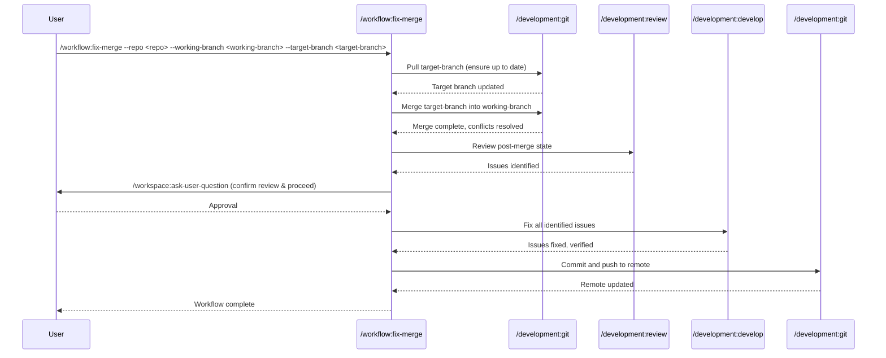

## PURPOSE

Merge from a target branch into the working branch, automatically resolving merge conflicts, identifying issues that arose from the merge, fixing them systematically, and pushing the result to remote.

## WORKFLOW PHASES

1. **Merge from Target Branch**: Pull target branch then perform merge operation and resolve all merge conflicts

   - Call `/development:git` with `--repo <repo>` `--branch <target-branch>` `--action pull` to ensure target branch is up to date
   - Call `/development:git` with `--repo <repo>` `--working-branch <working-branch>` `--target-branch <target-branch>` `--action merge`
   - Resolve merge conflicts with context from `--description`
   - **MANDATORY** Verify no unresolved conflicts remain

2. **Review Merge Result**: Identify issues that arose from the merge

   - Call `/development:review` with `--repo <repo>` `--branch <working-branch>` `--context "verification of merged related files"`
   - Focus only on issues merge files with conflict
   - Document all issues found
   - Call `/workspace:ask-user-question --question "Review findings confirmed. Approve proceeding to fixes?" --options "Proceed with fixes; Describe additional context"`

3. **Fix Issues**: Address all issues identified in the review

   - Call `/development:develop` with `--repo <repo>` `--branch <working-branch>` `--task "Fix post-merge issues"`
   - Fix all identified issues systematically
   - Re-run `/development:review` to verify fixes

4. **Push Changes**: Commit and push all changes to remote

   - Call `/development:git` with `--repo <repo>` `--branch <working-branch>` `--action push`
   - Push all commits to remote
   - **MANDATORY** Verify remote branch is updated

## DELEGATION

**MANDATORY**: Always invoke the agents defined in this command's frontmatter for their designated responsibilities. Never skip, replace, or simulate their behavior directly.

- `zzaia-developer-specialist` — Resolve merge conflicts, fix post-merge issues, verify compatibility
- `zzaia-workspace-manager` — Execute git merge, review, and push operations across worktrees

## WORKFLOW DIAGRAM



## ACCEPTANCE CRITERIA

- Merge from target branch completes without unresolved conflicts
- All post-merge issues identified and fixed
- All changes committed with conventional commit messages
- Remote branch reflects all local changes
- Working branch is clean and ready for continued development

## EXAMPLES

```
/workflow:fix-merge --repo myrepo --working-branch feature/new-api --target-branch develop
/workflow:fix-merge --repo myrepo --working-branch feature/new-api --target-branch develop --description "Expect conflicts in schema definitions"
```

## OUTPUT

- Merge completion status with conflict resolution details
- Post-merge review report with issues identified
- Fix verification report confirming all issues resolved
- Push confirmation with remote branch state
