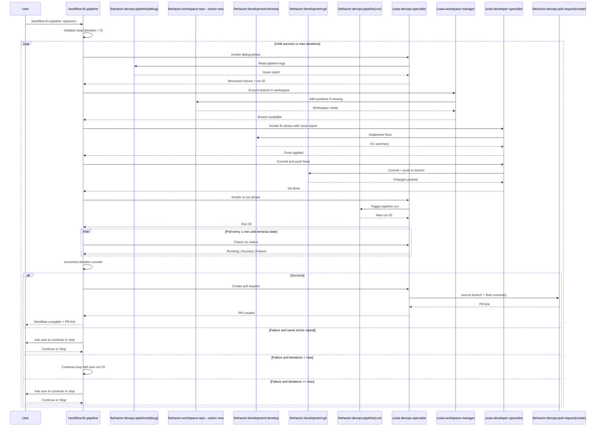

## PURPOSE

Automate iterative pipeline repair by cycling through debug, fix, and re-run phases until the pipeline completes successfully. Each iteration collects structured issue reports from pipeline logs, implements targeted fixes, triggers a new run, and evaluates results. The loop terminates on success or when max iterations is reached.

## WORKFLOW PHASES

1. **Initialize Loop** — Resolve parameters and set iteration counter to 0

   - If `--file` is provided, resolve git worktree context to infer `--project`, `--branch`, and `--pipeline` from remote URL, current branch, and YAML filename
   - Call `/behavior:devops:pipeline --action debug` with `--portal <portal> --project <project> --pipeline <pipeline> --run <run> --branch <branch>`
   - Capture structured issue report with all failed steps, errors, and warnings
   - Track returned run ID for subsequent phases
   - **MANDATORY** Record iteration 1 start time and initial issue count

2. **Setup Workspace** — Ensure target branch is available locally for any working repo

   - Call `/behavior:workspace:repo --action new` with `--repo <project> --branch <branch>` to any repo that will be worked on
   - Skip if branch worktree already exists in workspace
   - **MANDATORY** Branch must be checked out before fixes are applied

3. **Fix Issues** — Implement targeted fixes from the issue report

   - Call `/behavior:development:develop` with issue report as task context
   - Pass pipeline ID, branch, and list of failures to fix
   - **MANDATORY** Fixes must target pipeline YAML and source files identified in issue report
   - Await completion and capture fix summary

4. **Commit & Push** — Persist fixes to remote branch

   - Call `/behavior:development:git` with commit message summarizing fixes applied
   - Push changes to `<branch>` on remote
   - **MANDATORY** Changes must be pushed before triggering re-run

5. **Re-run Pipeline** — Trigger new pipeline run on target branch

   - Call `/behavior:devops:pipeline --action run` with `--portal <portal> --project <project> --pipeline <pipeline> --branch <branch>`
   - Capture new run ID and wait for completion
   - **MANDATORY** Extract run ID from response for next debug phase

6. **Evaluate Result** — Poll pipeline run status automatically

   - Wait 1 minute, then call `/behavior:devops:pipeline --action debug` to check run status
   - Repeat polling every 1 minute until run reaches a terminal state (Success or Failure)
   - Parse run result: **Success** or **Failure**
   - Increment iteration counter

7. **Loop Control** — Decide next action

   - **On Success**: stop loop, report completion summary, then proceed to Phase 8
   - **On Failure and iterations < max**: Go back to Phase 1 with new run ID
   - **On Failure and iterations >= max**: Ask user whether to continue or stop; stop if user declines
   - **On unresolvable failure** (same errors repeat across iterations): Ask user whether to continue or stop

8. **Create Pull Request** — Open PR after successful pipeline

   - Call `/behavior:devops:pull-request --action create --portal <portal> --project <project> --repo <repo> --source-branch <branch> --target-branch main`
   - Include summary of all fixes applied across iterations in PR description
   - Return PR link to user

## DELEGATION

**MANDATORY**: Always invoke the agents defined in this command's frontmatter for their designated responsibilities. Never skip, replace, or simulate their behavior directly.

- `zzaia-devops-specialist` — Debug pipeline logs, trigger runs, poll run status, confirm completion, and create pull requests
- `zzaia-workspace-manager` — Add branch worktree to workspace if not already present
- `zzaia-developer-specialist` — Analyze issue reports and implement fixes to pipeline files and source code

## WORKFLOW DIAGRAM



## ACCEPTANCE CRITERIA

- Workflow successfully orchestrates `/behavior:devops:pipeline --action debug`, `/behavior:workspace:repo --action new`, `/behavior:development:develop`, `/behavior:development:git`, `/behavior:devops:pipeline --action run`, and `/behavior:devops:pull-request --action create` in sequence
- Loop continues until pipeline succeeds or max iterations is reached
- Each iteration extracts new run ID from pipeline run response and uses it in next debug phase
- Pipeline status is polled automatically every 1 minute — user is never interrupted during polling
- User is asked to continue only when: max iterations reached OR same errors repeat across iterations
- On pipeline success, a pull request is automatically created with a summary of all fixes applied
- Iteration counter and safety limit are enforced
- Per-iteration summary includes iteration number, issue count, fixes applied, and run result
- Final report lists all changes made across all iterations and total time elapsed
- Agents are invoked for their designated responsibilities, never skipped or simulated

## EXAMPLES

```
/workflow:fix-pipeline --portal azure --file /home/user/workspace/myrepo.worktrees/feature/my-feature/azure-pipelines.yml

/workflow:fix-pipeline --portal azure --project MyProject --pipeline build-pipeline

/workflow:fix-pipeline --portal azure --project MyProject --pipeline deploy-prod --branch feature/my-feature --max-iterations 3

/workflow:fix-pipeline --portal azure --project MyProject --pipeline 42 --run 1850
```

## OUTPUT

- Per-iteration summary: iteration #, issues found, fixes applied, run result
- Final success report with total iterations, complete list of all changes made, and PR link
- Partial progress report if max iterations reached without success (user prompted to continue or stop)
- Pipeline run link and final run ID
