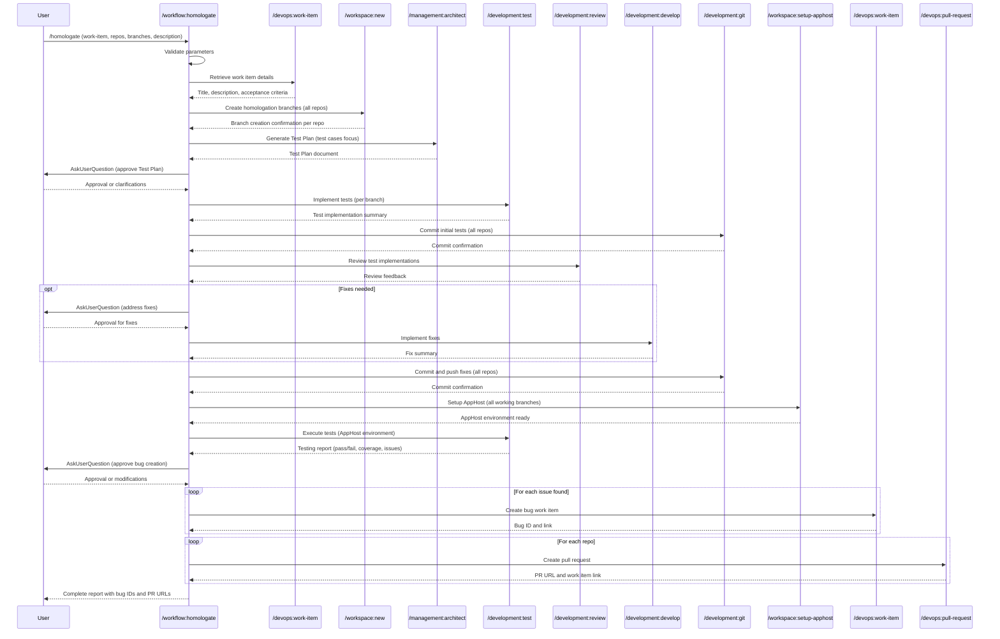

## PURPOSE

Orchestrate complete homologation (QA/acceptance testing) workflow for one or more applications simultaneously. Validates work item requirements, creates homologation branches, develops comprehensive test cases, executes tests against integrated environment, and reports bugs found.

## EXECUTION

1. **Retrieve Work Item**: Fetch work item details and acceptance criteria

   - Call `/devops:work-item --work-item <work-item>`
   - Extract title, description, acceptance criteria
   - **MANDATORY** Validate work item description is not empty

2. **Create Homologation Branches**: Setup branches in all specified repositories

   - Call `/workspace:new --repo <repo[i]> --target-branch <target-branch[i]> --branch <working-branch[i]>` for each repo/branch pair
   - Confirm branch creation in each repository

3. **Generate Test Plan**: Design test coverage from acceptance criteria

   - Call `/management:architect --description "<description>" --context "<acceptance-criteria>" --focus test-plan`
   - Document all test scenarios derived from acceptance criteria
   - Clarify testing scope with user via **AskUserQuestion**
   - Create concise Test Plan document covering test scope only

4. **User Approval**: Wait for Test Plan approval

   - Use **AskUserQuestion** to confirm test coverage completeness before proceeding

5. **Implement Tests**: Write and run tests in each working branch

   - Call `/development:test --repo <repo[i]> --branch <working-branch[i]> --action implement` for each repo
   - Implement test cases covering all acceptance criteria
   - Ensure test coverage across all specified repositories

6. **Commit Initial Tests**: Persist test implementations

   - Call `/development:git --repo <repo[i]> --branch <working-branch[i]> --action commit-push --message "test: <description> [#<work-item>]"` for each repo

7. **Review and Fix**: Validate test quality

   - Call `/development:review --repo <repo[i]> --branch <working-branch[i]>` for each repo
   - Use **AskUserQuestion** if improvements are needed
   - Call `/development:develop --repo <repo[i]> --branch <working-branch[i]> --task "Fix test review issues"` as needed

8. **Commit and Push Fixes**: Persist fixes

   - Call `/development:git --repo <repo[i]> --branch <working-branch[i]> --action commit-push --message "fix: <description> [#<work-item>]"` for each repo

9. **AppHost Setup and Test Execution**: Run integrated tests

   - Call `/workspace:setup-apphost --repos <repos> --branches <working-branches>`
   - Call `/development:test --repos <repos> --branches <working-branches> --environment apphost`
   - Generate testing report with pass/fail results, coverage metrics, and issues found
   - Use **AskUserQuestion** to confirm before proceeding to bug creation

10. **Create Bug Work Items**: File issues found in test execution

    - Call `/devops:work-item --create --type Bug --title "<issue>" --description "<steps-to-reproduce>" --severity <severity> --parent <work-item>` for each bug
    - Provide summary of all created bug work items with IDs and links

11. **Create Pull Requests**: Open PRs for all repositories

    - Call `/devops:pull-request --repo <repo[i]> --source-branch <working-branch[i]> --target-branch <target-branch[i]> --work-item <work-item> --draft` for each repo
    - Provide all PR URLs in final summary

## DELEGATION

**MANDATORY**: Always invoke the agents defined in this command's frontmatter for their designated responsibilities. Never skip, replace, or simulate their behavior directly.

- `zzaia-task-clarifier` — Analyze work item requirements and validate acceptance criteria
- `zzaia-repository-manager` — Manage homologation branch creation across multiple repositories
- `zzaia-tester-specialist` — Implement tests, execute test suites, and generate testing reports
- `zzaia-developer-specialist` — Review test implementations and fix issues discovered during homologation

## WORKFLOW



## ACCEPTANCE CRITERIA

- Work item details retrieved and passed through all phases
- Homologation branches successfully created in all specified repositories
- Test Plan documentation generated with clear test scenarios and acceptance criteria
- User explicitly approves Test Plan before implementation proceeds
- Tests implemented covering all acceptance criteria from work item
- AppHost environment configured with all working branches
- Tests executed against integrated AppHost environment with measurable results
- Testing report generated with clear pass/fail status and metrics
- Bug work items created for all found issues with complete details and linking
- Pull requests created for all repositories linking to the original work item
- All phase statuses reported with clear completion indicators

## EXAMPLES

```
/workflow:homologate --work-item 2001 --repos auth-service --target-branches develop --working-branches homolog/sprint-10 --description "Homologate authentication flow for sprint 10"

/workflow:homologate --work-item 2002 --repos auth-service,payment-service --target-branches develop,develop --working-branches homolog/sprint-10,homolog/sprint-10 --description "Homologate integrated checkout flow across auth and payment services"
```

## OUTPUT

- Phase completion status with indicators
- Work item details summary (title, description, acceptance criteria)
- Branch creation confirmation per repository
- Test Plan document reference and summary
- Test implementation report per repository
- AppHost setup confirmation with all configured branches
- Testing report with metrics: total tests, pass count, fail count, coverage percentage
- List of discovered issues per application
- Created bug work item IDs with direct links
- Pull request URLs per repository with work item references
- Final summary report
